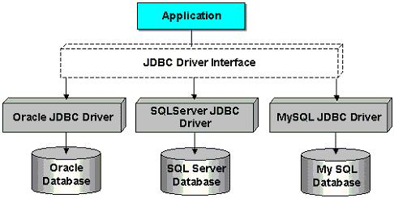

#JDBC简介



## 1 JDBC是什么？

JDBC是用于执行SQL的解决方案,开发人员使用JDBC的标准接口,数据库厂商则对接口进行操作,开发人员无须接触底层数据库驱动的差异性.

JDBC标准主要分为二个部分:JDBC应用程序开发接口(Applicaction Developer Interface)以及JDBC驱动程序开发者接口(Driver Developer Interface).如果你的应用程序需要联机数据库,就是调用JDBC应用程序开发者接口,相关API主要在java.sql与javax.sql两个包中.


## 2 JDBC驱动的种类

1. Type 1 JDBC-ODBC Bridge Driver
2. Type 2 Native API Driver
3. Type 3 JDBC-Net Driver
4. Type 4 Native Protocol Driver

**Type 4这种类型的驱动程序操作通常由数据库厂商直接提供,驱动程序操作会将JDBC调用转换为与数据库特定的网络协议,以与数据库进行沟通操作,这类的驱动我们用的比较多**

## 3 连接数据库步骤

基本数据库操作相关的JDBC接口或类是位于java.sql包中.要取得数据库联机,必须有几个动作:

* 注册Driver操作对象
* 取得Connection操作对象
* 关闭Connection操作对象

一个基本的DEMO

```
/**
 * Created by chuguangming on 16/8/26.
 */

import org.testng.annotations.Test;
import java.lang.Exception;
import java.sql.Connection;
import java.sql.DriverManager;
import java.sql.PreparedStatement;
import java.sql.SQLException;

public class TestJdbc {
    public static final String url = "jdbc:mysql://localhost:3306/blog";
    public static final String name = "com.mysql.jdbc.Driver";
    public static final String user = "root";
    public static final String password = "";
    public Connection conn = null;
    public PreparedStatement pst = null;
    @Test
    public void ConnectionDemo() {
        //打开数据库
        try
        {
            //指定连接类型
            Class.forName(name);
            conn = DriverManager.getConnection(url, user, password);//获取连接
            pst = conn.prepareStatement("select * from user");//准备执行语句
        } catch (Exception e)
        {
            e.printStackTrace();
        }
        //关闭数据库
        try
        {
            this.conn.close();
            this.pst.close();
        }
        catch (SQLException e)
        {
            e.printStackTrace();
        }

    }
}

```

## 4 一个简单的例子(POJO+DAO+Service)

**POJO**
```
package chu.jdbc;

import java.io.Serializable;
import java.util.Date;

/**
 * Created by chuguangming on 16/8/26.
 */
public class Blog implements Serializable {

    public String getUsername() {
        return username;
    }

    public void setUsername(String username) {
        this.username = username;
    }

    public String getPassword() {
        return password;
    }

    public void setPassword(String password) {
        this.password = password;
    }


    private String username;
    private String password;


    public Blog()
    {

    }
    public Blog(String username,String password)
    {
        this.username=username;
        this.password=password;
    }

}

```


**DAO**
```
package chu.jdbc;

/**
 * Created by chuguangming on 16/8/26.
 */

import java.sql.*;
import java.util.*;
import java.util.Date;


public class BlogDAO {
    private String url;
    private String user;
    private String passwd;

    public BlogDAO(String url, String user, String passwd) {
        this.url = url;
        this.user = user;
        this.passwd = passwd;
    }

    public void add(Blog blog) {
        try {
            Connection conn = DriverManager.getConnection(url, user, passwd);

           PreparedStatement statement=conn.prepareStatement("insert into user(username,password) values(?,?)");
            statement.setString(1,blog.getUsername());
            statement.setString(2,blog.getPassword());
            statement.executeUpdate();


        } catch (SQLException ex) {
            throw new RuntimeException(ex);
        }
    }

    public List<Blog> get() {
        List<Blog> blogs = new ArrayList<>();
        try {
            Connection connection = DriverManager.getConnection(url, user, passwd);
            Statement statement = connection.createStatement();
            ResultSet resultSet = statement.executeQuery("select * from user ");
            while (resultSet.next()) {
                Blog blog = toBlog(resultSet);
                blogs.add(blog);
            }
        } catch (SQLException ex) {
            throw new RuntimeException(ex);
        }
        return blogs;
    }

    private Blog toBlog(ResultSet result) throws SQLException {
        Blog blog = new Blog();
        blog.setUsername(result.getString(2));
        blog.setPassword(result.getString(3));
        return blog;
    }

}

```


**Service Test**

```
package chu.jdbc;

/**
 * Created by chuguangming on 16/8/26.
 */
import org.testng.annotations.Test;
import java.lang.Exception;
import java.sql.Connection;
import java.sql.DriverManager;
import java.sql.PreparedStatement;
import java.sql.SQLException;
import java.util.*;
public class TestBlog {
    public static final String url = "jdbc:mysql://localhost:3306/blog?"+
                                     "useUnicode=true&characterEncoding=UTF8";
    public static final String name = "com.mysql.jdbc.Driver";
    public static final String user = "root";
    public static final String password = "";
    public Connection conn = null;
    public PreparedStatement pst = null;


    @Test
    public void TestBlogAdd() {
        //打开数据库
        try
        {
            BlogDAO dao=new BlogDAO(url,user,password);
            dao.add(new Blog("楚广明","123456"));

        } catch (Exception e)
        {
            e.printStackTrace();
        }

    }

    @Test
    public void TestBlogGet() {
        //打开数据库
        try
        {
            BlogDAO dao=new BlogDAO(url,user,password);
            for(Blog tmp:dao.get())
            {
                System.out.printf("username:%s password:%s \n",tmp.getUsername(),tmp.getPassword());
            }

        } catch (Exception e)
        {
            e.printStackTrace();
        }

    }

}

```