#jFinal快速入门
##前置技能
1. java基础
2. B/S应用开发经验

##入门推荐学习路线

<span style="color:red">强烈要求，看本文档前，至少结合官方demo看过一遍pdf文档</span>

* 官网：http://www.jfinal.com/
* 手册：http://download.jfinal.com/upload/2.2/jfinal-2.2-manual.pdf

##IntelliJ IDEA开发环境搭建
####前置条件
1. 操作系统已经安装IntelliJ IDEA 14以上，并已经配好java环境
2. 对gradle有一点了解
3. 对maven有一点了解
4. 对java Web开发有一定了解
5. mysql的基础知识

####搭建步骤
######一、新建项目

1）点击“Create New Project”；

2）在“Additional Libraries and Frameworks”中，选择Java和Web，点击next；

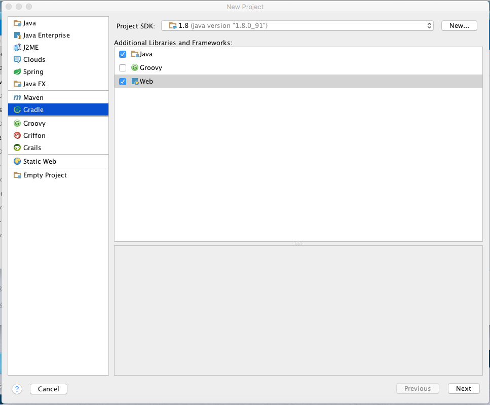

3）填写GroupId和ArtifactiId，这两项可以根据需要随便填，之后点击next；

4）这里直接使用idea自带的gradle，并勾选前面两项，如下图：

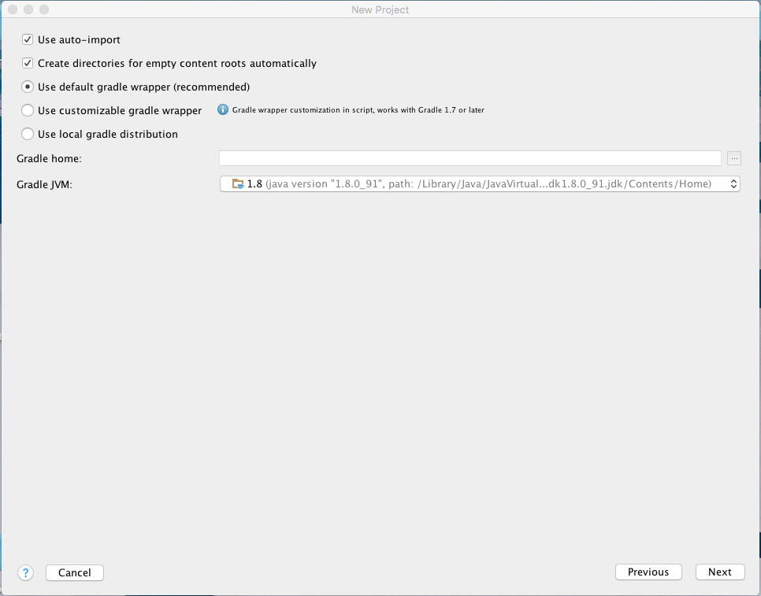

点击next；

5）修改必要参数，点击Finish；

######二、配置项目

1）等待idea下方的进度条完成，之后项目的目录结构如下图：

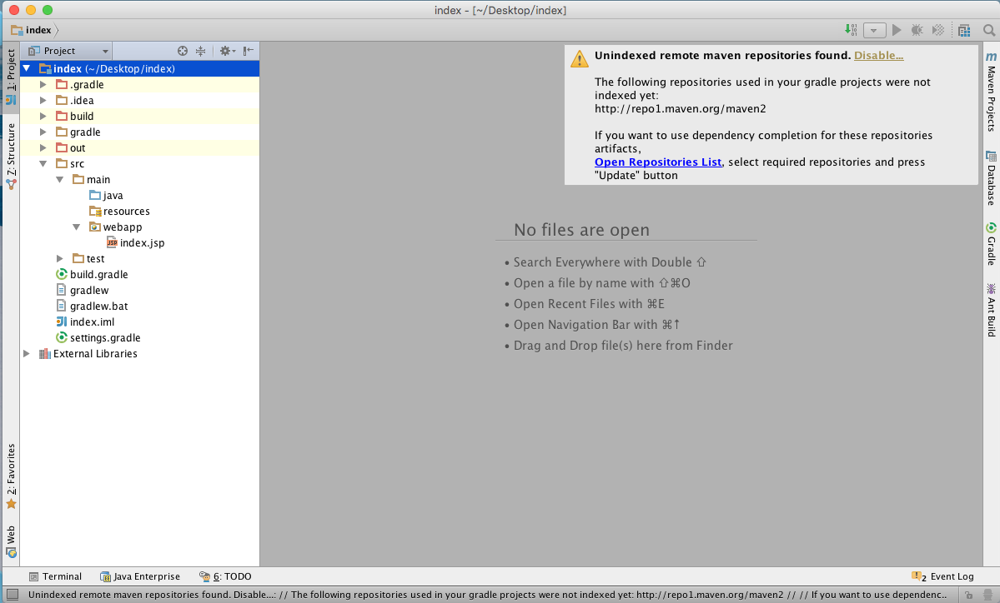

其中有个警告，可以忽略，这是由于中国防火墙问题，导致maven repositorise的索引跟新失效。

2）打开build.gradle文件，这是自动化构建的主文件，首先添加gretty插件，用于开发时运行web服务器容器，代码如下：

```
apply from: 'https://raw.github.com/akhikhl/gretty/master/pluginScripts/gretty.plugin'

```

3）将mave的依赖库替换成阿里的：

mavenCentral() 替换为 maven { url 'http://maven.aliyun.com/nexus/content/groups/public/' }

4）添加jfinal相关依赖：

```
    compile group: 'com.jfinal', name: 'jfinal', version: '2.2'
    testCompile group: 'junit', name: 'junit', version: '4.11'
    compile group: 'mysql', name: 'mysql-connector-java', version: '5.1.38'
    compile group: 'c3p0', name: 'c3p0', version: '0.9.1.2'

```

最终文件类似如下：

```
group 'com.hithinksoft'
version '1.0-SNAPSHOT'

apply plugin: 'java'
apply plugin: 'war'

apply from: 'https://raw.github.com/akhikhl/gretty/master/pluginScripts/gretty.plugin'

sourceCompatibility = 1.5

repositories {
    maven { url 'http://maven.aliyun.com/nexus/content/groups/public/' }
}

dependencies {
    compile group: 'com.jfinal', name: 'jfinal', version: '2.2'
    testCompile group: 'junit', name: 'junit', version: '4.11'
    compile group: 'mysql', name: 'mysql-connector-java', version: '5.1.38'
    compile group: 'c3p0', name: 'c3p0', version: '0.9.1.2'
}

```
5）点击右侧的Gradle，弹出弹窗后点击刷新按钮（当然，你修改gradle文件时，可能他已经自动刷新，但是保险起见，手动刷新下），如下图：


######三、运行一个jFinal例子
步骤二完成后，jfinal的开发环境基本完成，下面步骤，将带领大家真正跑起一个项目。

1）准备模拟数据。方便起见，这里直接导入jfinal官方demo的数据：首先创建数据库，本例子中取名为“test”，下载官方demo，解压->源代码->blog.sql,在数据库客户端中执行代码即可。

2）编写模型生成器。

a.找到src->main->resources这个静态资源文件，右击创建config.tex，项目的配置文件，并填好相关配置项，如下图：

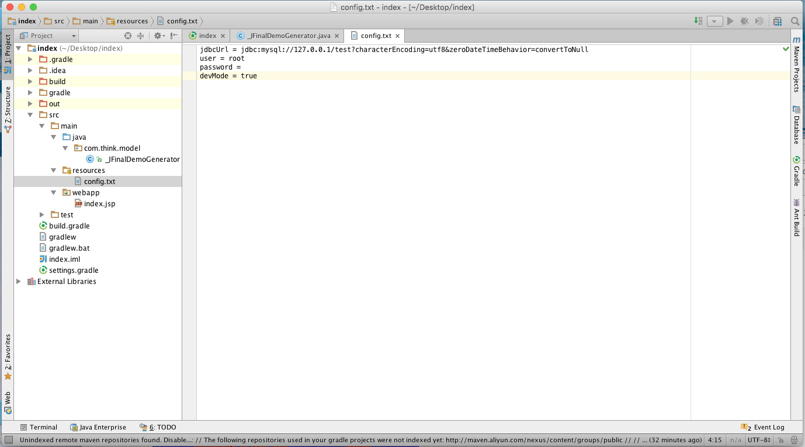

主要是配置jdbc链接，以及数据库的用户名和密码；

b.找到src->main->java这个源代码目录，右击创建包，点击创建的包，右击创建DemoConfig文件，jFinal主配置文件，并编写数据库连接池代码，如下图：

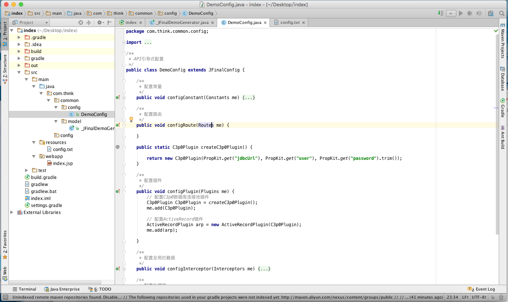

c.找到src->main->java这个源代码目录，右击创建包，点击创建的包，右击创建_JFinalDemoGenerator文件，并编写相关模型生成器代码，如下图：

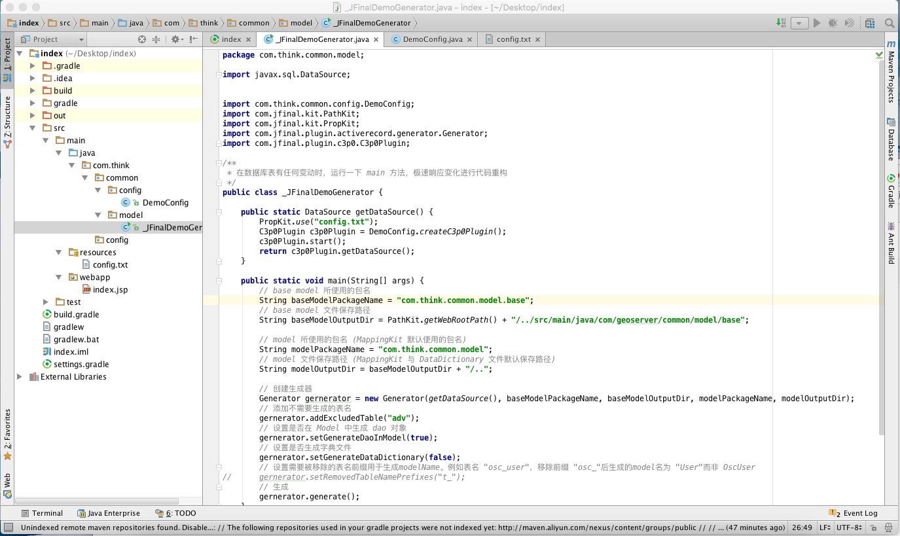

d.右击_JFinalDemoGenerator->run，稍等片刻，模型生成器就会为我们生成各种模型类，如下图：

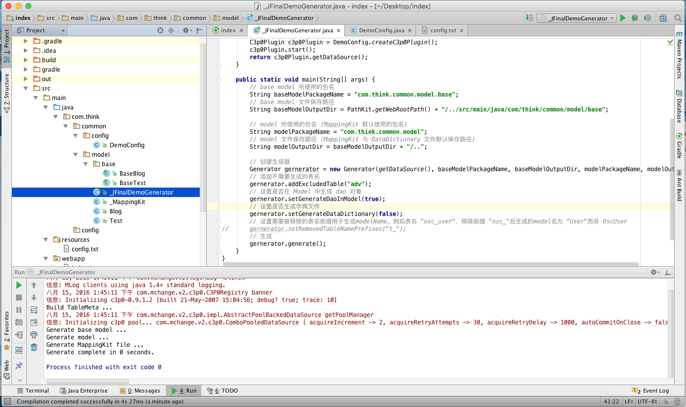

OK！到此，模型已经准备完毕，接下来就是Controller和View了。

3）Controller和View

a.新建一个IndexController并，编写相关数据操作方法，这里就存取了一下，如下图：

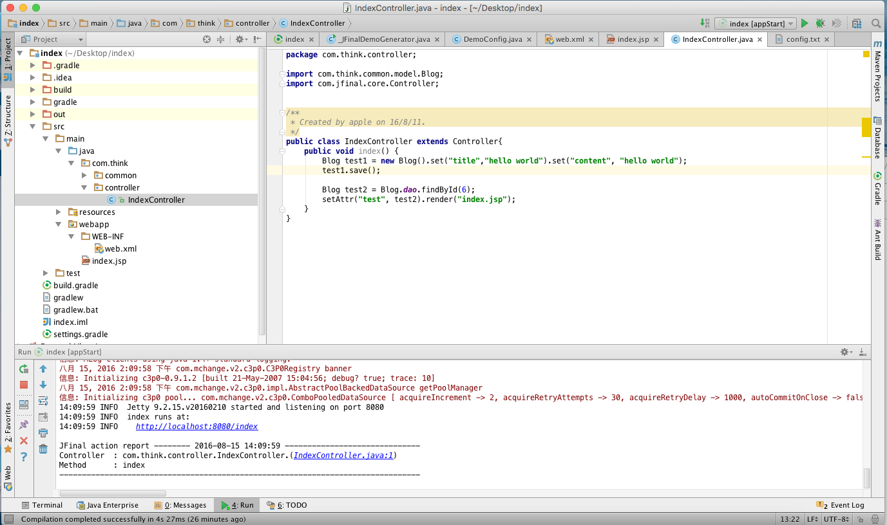

b.在DemoConfig中配置路由，以及一些常量配置、插件配置等，如下图：

<span style="color:red">图看不清没关系，demo在压缩包中，自己看情况查看</span>

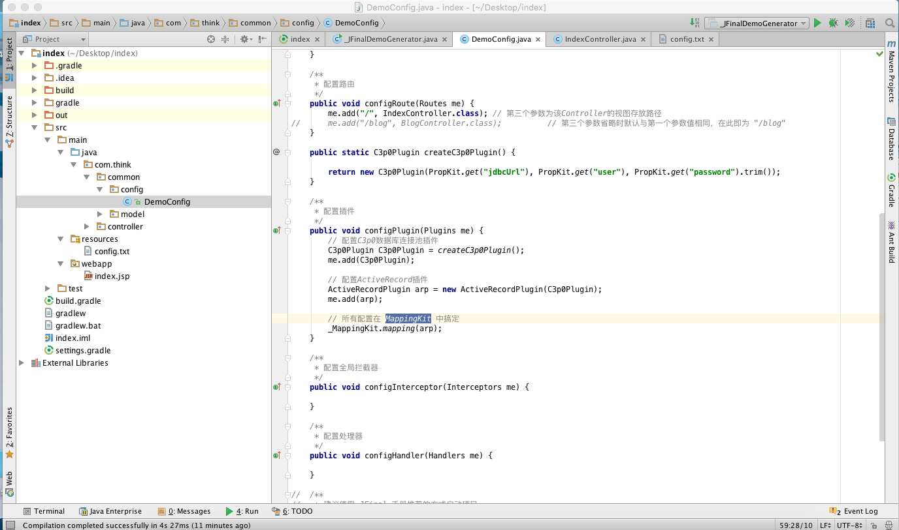

c.添加web.xml。File->Project Structure,选择第二个Modules，选择Web Gradle:...,选择右边第一个框的加号，如下图：

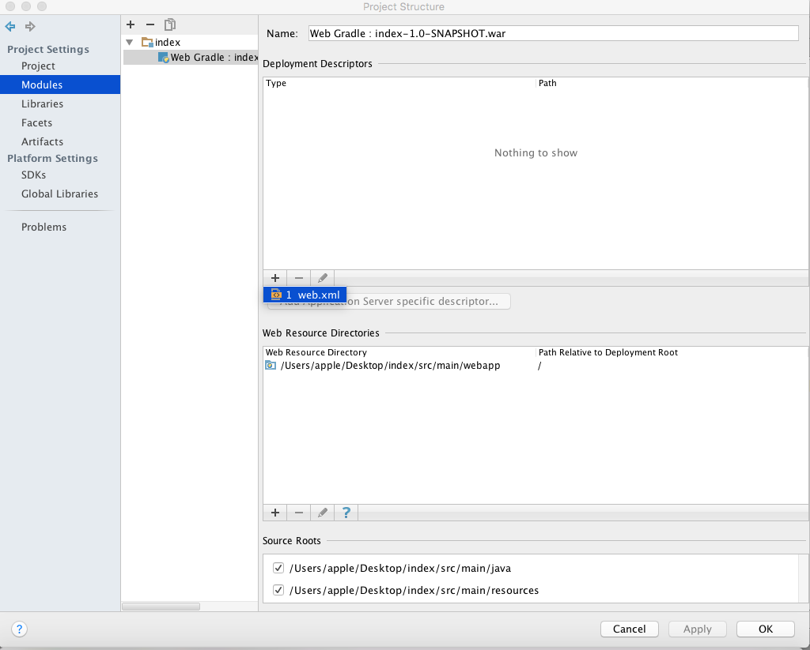

d.选择web.XML,修改路径到src/main/webapp下面，点击完成，修改jFinal配置，如下图：

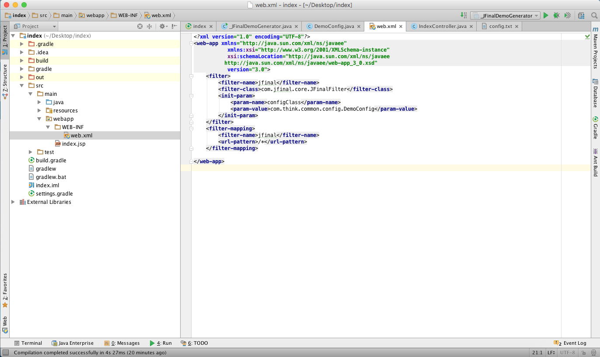

e.修改index.jsp，如下图：


4）运行程序

选择右边的Gradle，选择Tasks，选择gretty，双击appStart，运行服务器，如下图：

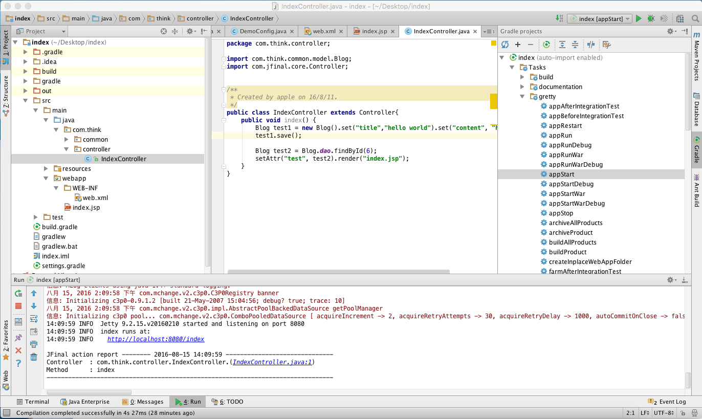

浏览器中打开http://localhost:8080/index，即可看到Holle World；

到此整个demo都运行起来了，真正开发过程中，各功能自己稍微摸索下就可以了，这里不再累述。


