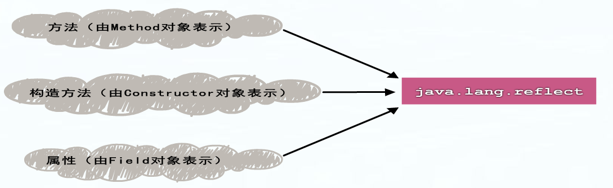

#反射简介



## 1 Java反射是什么？

JAVA反射机制是在运行状态中，对于任意一个类，都能够知道这个类的所有属性和方法；对于任意一个对象，都能够调用它的任意一个方法和属性；这种动态获取的信息以及动态调用对象的方法的功能称为java语言的反射机制。

JAVA反射（放射）机制：“程序运行时，允许改变程序结构或变量类型，这种语言称为动态语言”。从这个观点看，Perl，Python，Ruby是动态语言，C++，Java，C#不是动态语言。但是JAVA有着一个非常突出的动态相关机制：Reflection，用在Java身上指的是我们可以于运行时加载、探知、使用编译期间完全未知的classes。换句话说，Java程序可以加载一个运行时才得知名称的class，获悉其完整构造（但不包括methods定义），并生成其对象实体、或对其fields设值、或唤起其methods。


```
package chu.Reflection;

/**
 * Created by chuguangming on 16/8/30.
 */
import org.testng.annotations.Test;
public class ClassInfo {
    @Test
    public void TestBlogAdd() {
        Class clz=String.class;
        System.out.println("类名称:"+clz.getName());
        System.out.println("是否为接口:"+clz.isInterface());
        System.out.println("是否为基本类型:"+clz.isPrimitive());
        System.out.println("是否为数组对象:"+clz.isArray());
        System.out.println("父类名称:"+clz.getSuperclass().getName());

    }

}

```

## 从Class中获取信息

```
package chu.Reflection;

import org.testng.annotations.Test;

import static java.lang.System.out;

import java.lang.reflect.Constructor;
import java.lang.reflect.Field;
import java.lang.reflect.Method;
import java.lang.reflect.Modifier;

/**
 * Created by chuguangming on 16/8/30.
 */
class Some2 {
    public String test;
    private static int testint;

    static {
        System.out.println("静态代码区域");
    }

    public String test() {
        return "test";
    }
}

public class ClassInfo2 {
    @Test
    public void Test() throws ClassNotFoundException {
        Class clz = Class.forName("chu.Reflection.Some2", false, Some2.class.getClassLoader());
        System.out.println("已经载入Some2.class");
        showPackageInfo(clz);
        showClassInfo(clz);
        showFiledsInfo(clz);
        showConstructorsInfo(clz);
        showMethodsInfo(clz);

    }

    private static void showPackageInfo(Class clz) {
        Package p = clz.getPackage();
        System.out.printf("package: %s ; %n ", p.getName());
    }

    private static void showClassInfo(Class clz) {
        int modifier = clz.getModifiers();//获取类型修饰常数
        System.out.printf("class:%s %s %s", Modifier.toString(modifier),
                Modifier.isInterface(modifier) ? "interface" : "class",
                clz.getName());
    }

    private static void showFiledsInfo(Class clz) throws SecurityException {
        // 取得宣告的資料成員代表物件
        Field[] fields = clz.getDeclaredFields();
        for (Field field : fields) {
            // 顯示權限修飾，像是public、protected、private
            out.printf("\t%s %s %s;%n",
                    Modifier.toString(field.getModifiers()),
                    field.getType().getName(), // 顯示型態名稱
                    field.getName() // 顯示資料成員名稱
            );
        }
    }

    private static void showConstructorsInfo(Class clz) throws SecurityException {
        // 取得宣告的建構方法代表物件
        Constructor[] constructors = clz.getDeclaredConstructors();
        for (Constructor constructor : constructors) {
            // 顯示權限修飾，像是public、protected、private
            out.printf("\t%s %s();%n",
                    Modifier.toString(constructor.getModifiers()),
                    constructor.getName() // 顯示建構式名稱
            );
        }
    }

    private static void showMethodsInfo(Class clz) throws SecurityException {
        // 取得宣告的方法成員代表物件
        Method[] methods = clz.getDeclaredMethods();
        for (Method method : methods) {
            // 顯示權限修飾，像是public、protected、private
            out.printf("\t%s %s %s();%n",
                    Modifier.toString(method.getModifiers()),
                    method.getReturnType().getName(), // 顯示返回值型態名稱
                    method.getName() // 顯示方法名稱
            );
        }
    }
}

```