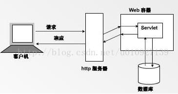
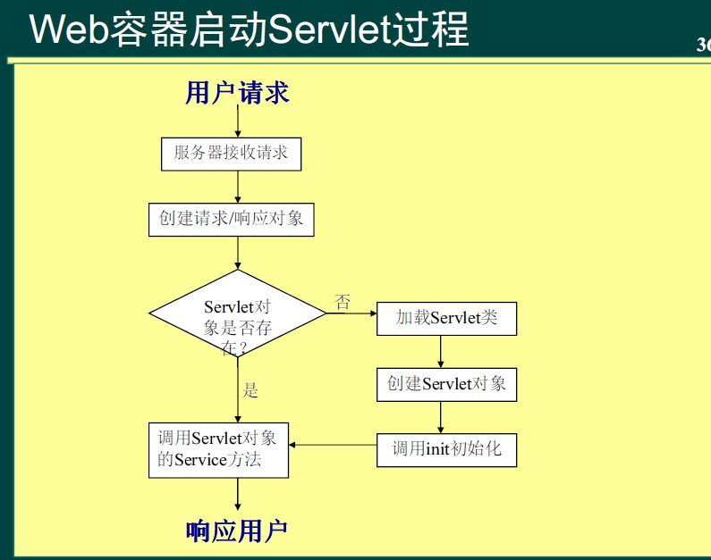
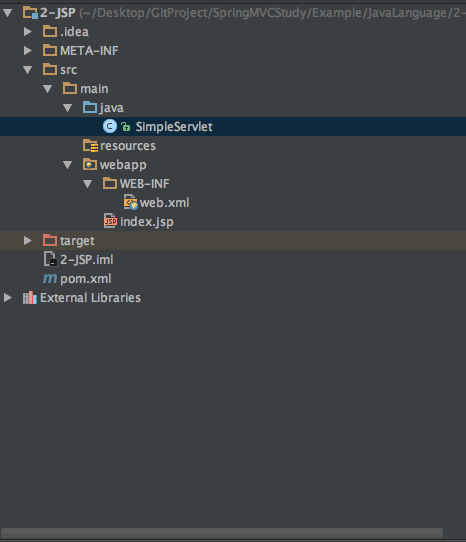
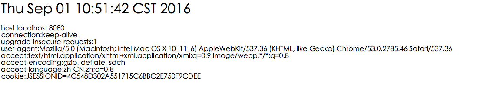

#Servlet简介

## 1 什么是Web容器



web容器是一种服务程序，就是为应用服务器组（如jsp，servlet等）提供一个运行环境，使JSP、servlet直接跟容器中的环境变量接口交互，不必关注其他系统问题。主要有web服务器来实现。

例如：tomcat、WebLogic，WebSphere等。该容器提供的接口严格遵守j2ee规范的web application标准。我们把遵循以上标准的web服务就叫做j2ee中的web容器。

1. web 容器

何为容器：

**容器是一种服务调用规范框架，J2EE 大量运用了容器和组件技术来构建分层的企业级应用。在 J2EE 规范中，相应的有 WEB Container 和 EJB Container 等**

WEB 容器给处于其中的应用程序组件（JSP，SERVLET）提供一个环境，使 JSP，SERVLET 直接跟容器中的环境变量交互，不必关注其它系统问题（从这个角度来说，web 容器应该属于架构上的概念）。web 容器主要由 WEB 服务器来实现。例如：TOMCAT，WEBLOGIC，WEBSPHERE 等。

若容器提供的接口严格遵守 J2EE 规范中的 WEB APPLICATION 标准。我们把该容器叫做 J2EE 中的 WEB 容器.

WEB 容器更多的是跟基于 HTTP 的请求打交道。而 EJB 容器不是。它是更多的跟数据库、其它服务打交道。

容器的行为是 将其内部的应用程序组件与外界的通信协议交互进行了隔离，从而减轻内部应用程序组件的负担（实现方面的负担？）。例如，SERVLET 不用关心 HTTP 的细节，而是直接引用环境变量 session、request、response 就行、EJB 不用关心数据库连接速度、各种事务控制，直接由容器来完成。

2. Web服务器

Web 服务器（Web Server）可以处理 HTTP 协议。当 Web 服务器接收到一个 HTTP 请求，会返回一个 HTTP 响应，例如送回一个 HTML 页面。

Web 服务器可以响应针对静态页面或图片的请求， 进行页面跳转（redirect），或者把动态响应（dynamic response）的产生委托（delegate）给一些其它的程序，例如 CGI 脚本，JSP（JavaServer Pages）脚本servlets，ASP（Active Server Pages）脚本，服务器端 JavaScript，或者一些其它的服务器端技术。

Web 服务器仅仅提供一个可以执行服务器端程序和返回(程序所产生的)响应的环境，而不会超出职能范围。Web 服务器主要是处理需要向浏览器发送 HTML 的请求以供浏览。

3. 应用程序服务器（The Application Server)

根据定义，作为应用程序服务器，要求可以通过各种协议（包括 HTTP 协议）把商业逻辑暴露给（expose）客户端应用程序。应用程序使用此商业逻辑就像你调用对象的一个方法或过程（语言中的一个函数）一样。

4. Tomcat

Tomcat 服务器是一个免费的开放源代码的 Web 应用服务器，属于轻量级应用服务器，在中小型系统和并发访问用户不是很多的场合下被普遍使用，是开发和调试 JSP 程序的首选。对于一个初学者来说，可以这样认为，当在一台机器上配置好 Apache 服务器，可利用它响应对 HTML 页面的访问请求。实际上 Tomcat 部分是Apache 服务器的扩展，但它是独立运行的，所以当你运行 tomcat 时，它实际上作为一个与 Apache 独立的进程单独运行的。

**Apache Tomcat is an open source software implementation of the Java Servlet and JavaServer Pages technologies.**

##2 Tomcat与Web服务器、应用服务器的关系

Tomcat 服务器是一个免费的开放源代码的 Web 应用服务器。因为 Tomcat 技术先进、性能稳定且免费，所以深受 Java 爱好者的喜爱并得到了部分软件开发商的认可，成为目前比较流行的 Web 应用服务器。

一、Tomcat 与应用服务器

到目前为止，Tomcat 一直被认为是 Servlet/JSP API 的执行器，也就所谓的 Servlet 容器。然而，Tomcat并不仅仅如此，它还提供了 JNDI 和 JMX API 的实现机制。尽管如此，Tomcat 仍然还不能算是应用服务器，因为它不提供大多数 J2EE API 的支持。

很有意思的是，目前许多的应用服务器通常把 Tomcat 作为它们 Servlet 和 JSP API 的容器。由于 Tomcat允许开发者只需通过加入一行致谢，就可以把 Tomcat 嵌入到它们的应用中。遗憾的是，许多商业应用服务器并没有遵守此规则。

对于开发者来说，如果是为了寻找利用 Servlet、JSP、JNDI 和 JMX 技术来生成 Java Web 应用的话，选择Tomcat 是一个优秀的解决方案；但是为了寻找支持其他的 J2EE API，那么寻找一个应用服务器或者把 Tomcat作为应用服务器的辅助，将是一个不错的解决方案；第三种方式是找到独立的 J2EE API 实现，然后把它们跟Tomcat 结合起来使用。虽然整合会带来相关的问题，但是这种方式是最为有效的。

二、Tomcat 与 Web 服务器

Tomcat 是提供一个支持 Servlet 和 JSP 运行的容器。Servlet 和 JSP 能根据实时需要，产生动态网页内容。而对于 Web 服务器来说， Apache 仅仅支持静态网页，对于支持动态网页就会显得无能为力；Tomcat 则既能为动态网页服务，同时也能为静态网页提供支持。尽管它没有通常的 Web 服务器快、功能也不如 Web 服务器丰富，但是 Tomcat 逐渐为支持静态内容不断扩充。大多数的 Web 服务器都是用底层语言编写如 C，利用了相应平台的特征，因此用纯 Java 编写的 Tomcat 执行速度不可能与它们相提并论。

一般来说，大的站点都是将 Tomcat 与 Apache 的结合，Apache 负责接受所有来自客户端的 HTTP 请求，然后将 Servlets 和 JSP 的请求转发给 Tomcat 来处理。Tomcat 完成处理后，将响应传回给 Apache，最后 Apache 将响应返回给客户端。


## 2 Servlet是什么？



【serverlet】

Servlet（Server Applet），全称 Java Servlet，未有中文译文。是用 Java 编写的服务器端程序。其主要功能在于交互式地浏览和修改数据，生成动态 Web 内容。狭义的 Servlet 是指 Java 语言实现的一个接口，广义的 Servlet 是指任何实现了这个 Servlet 接口的类，一般情况下，人们将 Servlet 理解为后者。

Servlet 运行于支持 Java 的应用服务器中。从实现上讲，Servlet 可以响应任何类型的请求，但绝大多数情况下 Servlet 只用来扩展基于 HTTP 协议的 Web 服务器。


## 3 一个简单的Servlet例子

**项目结构**



**SimpleServlet**

```
import javax.servlet.ServletException;
import javax.servlet.annotation.WebServlet;
import javax.servlet.http.HttpServlet;
import javax.servlet.http.HttpServletRequest;
import javax.servlet.http.HttpServletResponse;
import java.io.IOException;
import java.io.PrintWriter;

/**
 * Created by chuguangming on 16/8/31.
 */
@WebServlet(name = "SimpleServlet")
public class SimpleServlet extends HttpServlet {
    protected void doPost(HttpServletRequest request, HttpServletResponse response) throws ServletException, IOException {


    }

    protected void doGet(HttpServletRequest request, HttpServletResponse response) throws ServletException, IOException {

        response.setContentType("text/html;charset=UTF-8");
        PrintWriter out=response.getWriter();

        out.println("<html>");
        out.println("<head>");
        out.println("<title>SimpleServlet</title>");
        out.println("</head>");
        out.println("<body>");
        out.println("<h1>"+new java.util.Date()+"</h1>");
        out.println("</body>");
        out.println("</html>");


    }
}

```

**web.xml**

```
<!DOCTYPE web-app PUBLIC
 "-//Sun Microsystems, Inc.//DTD Web Application 2.3//EN"
 "http://java.sun.com/dtd/web-app_2_3.dtd" >

<web-app>
  <display-name>Archetype Created Web Application</display-name>
  <servlet>
    <servlet-name>SimpleServlet</servlet-name>
    <servlet-class>SimpleServlet</servlet-class>
  </servlet>
  <servlet-mapping>
    <servlet-name>SimpleServlet</servlet-name>
    <url-pattern>/demo</url-pattern>
  </servlet-mapping>

</web-app>

```

## 4 获取Header信息

```
package com.chu;
import javax.servlet.ServletException;
import javax.servlet.annotation.WebServlet;
import javax.servlet.http.HttpServlet;
import javax.servlet.http.HttpServletRequest;
import javax.servlet.http.HttpServletResponse;
import java.io.IOException;
import java.io.PrintWriter;
import java.util.Enumeration;

/**
 * Created by chuguangming on 16/8/31.
 */
@WebServlet(name = "GetHeaderInfo")
public class GetHeaderInfo extends javax.servlet.http.HttpServlet {
    protected void doPost(javax.servlet.http.HttpServletRequest request, javax.servlet.http.HttpServletResponse response)
            throws javax.servlet.ServletException, java.io.IOException {

    }

    protected void doGet(javax.servlet.http.HttpServletRequest request, javax.servlet.http.HttpServletResponse response)
            throws javax.servlet.ServletException, java.io.IOException {
        response.setContentType("text/html;charset=UTF-8");
        PrintWriter out=response.getWriter();

        out.println("<html>");
        out.println("<head>");
        out.println("<title>GetHeaderInfo</title>");
        out.println("</head>");
        out.println("<body>");
        out.println("<h1>"+new java.util.Date()+"</h1>");
        //获取所有标头名称
        Enumeration<String> names=request.getHeaderNames();
        while(names.hasMoreElements())
        {
            String name=names.nextElement();
            out.println(name+":"+request.getHeader(name)+"<br>");
        }
        out.println("</body>");
        out.println("</html>");

    }
}

```



**web.xml**

```
<?xml version="1.0" encoding="UTF-8"?>
<web-app version="2.4"
         xmlns="http://java.sun.com/xml/ns/j2ee"
         xmlns:xsi="http://www.w3.org/2001/XMLSchema-instance"
         xsi:schemaLocation="http://java.sun.com/xml/ns/j2ee
http://java.sun.com/xml/ns/j2ee/web-app_2_4.xsd">

    <display-name>Archetype Created Web Application</display-name>
    <servlet>
        <servlet-name>SimpleServlet</servlet-name>
        <servlet-class>SimpleServlet</servlet-class>
    </servlet>
    <servlet-mapping>
        <servlet-name>SimpleServlet</servlet-name>
        <url-pattern>/demo</url-pattern>
    </servlet-mapping>

    <servlet>
        <servlet-name>GetHeaderInfo</servlet-name>
        <servlet-class>com.chu.GetHeaderInfo</servlet-class>
    </servlet>
    <servlet-mapping>
        <servlet-name>GetHeaderInfo</servlet-name>
        <url-pattern>/GetHeaderInfo</url-pattern>
    </servlet-mapping>

</web-app>

```

## 5 提交表单

**表单**

```
<!DOCTYPE html>
<html lang="en">
<head>
    <meta charset="UTF-8">
    <title>GET请求</title>
</head>
<body>
<form method="get" action="/Encoding">
    名称:<input type="text" name="nameGet"><br/>
    <button>送出GET请求</button>
</form>
</body>
</html>
```


**Servlet**

```
package com.chu;

import javax.servlet.ServletException;
import javax.servlet.annotation.WebServlet;
import javax.servlet.http.HttpServlet;
import javax.servlet.http.HttpServletRequest;
import javax.servlet.http.HttpServletResponse;
import java.io.IOException;
import java.io.PrintWriter;
import java.util.Enumeration;

/**
 * Created by chuguangming on 16/8/31.
 */
@WebServlet(name = "GetHeaderInfo")
public class EncodingServlet extends javax.servlet.http.HttpServlet {
    protected void doPost(javax.servlet.http.HttpServletRequest request, javax.servlet.http.HttpServletResponse response)
            throws javax.servlet.ServletException, java.io.IOException {

    }

    protected void doGet(javax.servlet.http.HttpServletRequest request, javax.servlet.http.HttpServletResponse response)
            throws javax.servlet.ServletException, java.io.IOException {
        request.setCharacterEncoding("UTF-8");
        String name=request.getParameter("nameGet");
        response.setContentType("text/html;charset=UTF-8");
        PrintWriter out=response.getWriter();
        out.println(name);
    }
}

```

**web.xml**

```
<?xml version="1.0" encoding="UTF-8"?>
<web-app version="2.4"
         xmlns="http://java.sun.com/xml/ns/j2ee"
         xmlns:xsi="http://www.w3.org/2001/XMLSchema-instance"
         xsi:schemaLocation="http://java.sun.com/xml/ns/j2ee
http://java.sun.com/xml/ns/j2ee/web-app_2_4.xsd">

    <display-name>Archetype Created Web Application</display-name>
    <servlet>
        <servlet-name>SimpleServlet</servlet-name>
        <servlet-class>SimpleServlet</servlet-class>
    </servlet>
    <servlet-mapping>
        <servlet-name>SimpleServlet</servlet-name>
        <url-pattern>/demo</url-pattern>
    </servlet-mapping>

    <servlet>
        <servlet-name>GetHeaderInfo</servlet-name>
        <servlet-class>com.chu.GetHeaderInfo</servlet-class>
    </servlet>
    <servlet-mapping>
        <servlet-name>GetHeaderInfo</servlet-name>
        <url-pattern>/GetHeaderInfo</url-pattern>
    </servlet-mapping>

    <servlet>
        <servlet-name>Encoding</servlet-name>
        <servlet-class>com.chu.EncodingServlet</servlet-class>
    </servlet>
    <servlet-mapping>
        <servlet-name>Encoding</servlet-name>
        <url-pattern>/Encoding</url-pattern>
    </servlet-mapping>
</web-app>

```


## 6 文件上传

**Servlet** 

```
package com.chu;

import javax.servlet.ServletException;
import javax.servlet.annotation.MultipartConfig;
import javax.servlet.annotation.WebServlet;
import javax.servlet.http.HttpServlet;
import javax.servlet.http.HttpServletRequest;
import javax.servlet.http.HttpServletResponse;
import javax.servlet.http.Part;
import java.io.*;
import java.util.Enumeration;

/**
 * Created by chuguangming on 16/8/31.
 */
@MultipartConfig
@WebServlet(name = "Upload")
public class UploadServlet extends javax.servlet.http.HttpServlet {
    protected void doPost(javax.servlet.http.HttpServletRequest request, javax.servlet.http.HttpServletResponse response)
            throws javax.servlet.ServletException, java.io.IOException {

        /*
        Part part=request.getPart("photo");
        String filename=getFilename(part);
        writeTo(filename,part);
        System.out.println(filename);
        */
        request.setCharacterEncoding("UTF-8");
        Part part=request.getPart("photo");
        String filename=getFilename(part);
        part.write(filename);


    }

    protected void doGet(javax.servlet.http.HttpServletRequest request, javax.servlet.http.HttpServletResponse response)
            throws javax.servlet.ServletException, java.io.IOException {

    }

    private String getFilename(Part part)
    {
        String header=part.getHeader("Content-Disposition");
        String filename=header.substring(header.indexOf("filename=\"")+10,header.lastIndexOf("\""));
        return filename;
    }

    private void writeTo(String filename,Part part) throws IOException,FileNotFoundException
    {
        InputStream in=part.getInputStream();
        OutputStream out=new FileOutputStream(filename);
        byte [] buffer =new byte[1024];
        int length=-1;
        while ((length=in.read(buffer))!=-1)
        {
            out.write(buffer,0,length);
        }
        in.close();
        out.close();
    }

}

```


**Html**


```
<!DOCTYPE html>
<html lang="en">
<head>
    <meta charset="UTF-8">
    <title>上传Demo</title>
    <meta http-equiv="Content-Type" content="text/html" charset="utf-8">
</head>
<body>
    <form action="Upload" method="post" enctype="multipart/form-data">
        上传照片:<input type="file" name="photo" /><br><br>
        <input type="submit" value="上传" name="upload">
    </form>
</body>
</html>
```


## 7 使用RequestDispatcher调派请求

在WEB应用程序中,经常需要多个Servlet来完成请求.例如,将别一个Servlet的请求处理流程包含进来,或将请求转发(Forward)给别的Servlet处理.如果有这类的需求,可以使用HttpServletRequest的getRequestDispatcher()方法取得RequestDispatcher接口的实现对象实例,调用时指定转发或包含的相对URL网址.


## 8 过滤器

PerformanceFilter.java

```
package com.chu;

import java.io.IOException;
import javax.servlet.Filter;
import javax.servlet.FilterChain;
import javax.servlet.FilterConfig;
import javax.servlet.ServletException;
import javax.servlet.ServletRequest;
import javax.servlet.ServletResponse;
import javax.servlet.annotation.WebFilter;

@WebFilter(filterName = "performance", urlPatterns = {"/*"})
public class PerformanceFilter implements Filter {
    private FilterConfig config;

    @Override
    public void init(FilterConfig config) throws ServletException {
        this.config = config;
    }

    @Override
    public void doFilter(ServletRequest request,
                         ServletResponse response,
                         FilterChain chain)
            throws IOException, ServletException {
        long begin = System.currentTimeMillis();
        chain.doFilter(request, response);
        config.getServletContext().log("Request process in " +
                (System.currentTimeMillis() - begin) + " milliseconds");
        System.out.println("Request process in " +
                (System.currentTimeMillis() - begin) + " milliseconds");
    }

    @Override
    public void destroy() {
    }
}

```

web.xml

```
<?xml version="1.0" encoding="UTF-8"?>
<web-app version="2.4"
         xmlns="http://java.sun.com/xml/ns/j2ee"
         xmlns:xsi="http://www.w3.org/2001/XMLSchema-instance"
         xsi:schemaLocation="http://java.sun.com/xml/ns/j2ee
http://java.sun.com/xml/ns/j2ee/web-app_2_4.xsd">

    <display-name>Archetype Created Web Application</display-name>

    <filter>
        <filter-name>performance</filter-name>
        <filter-class>com.chu.PerformanceFilter</filter-class>
    </filter>
    <filter-mapping>
        <filter-name>performance</filter-name>
        <url-pattern>/*</url-pattern>
    </filter-mapping>
</web-app>

```