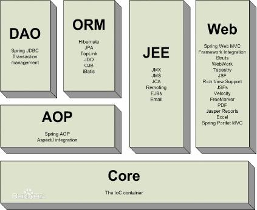

#Spring简介



## 1 spring是什么？

* 目的：解决企业应用开发的复杂性

* 功能：使用基本的JavaBean代替EJB，并提供了更多的企业应用功能

* 范围：任何Java应用

   **简单来说，Spring是一个轻量级的控制反转(IoC)和面向切面(AOP)的容器框架**

1. 轻量——从大小与开销两方面而言Spring都是轻量的。完整的Spring框架可以在一个大小只有1MB多的JAR文件里发布。并且Spring所需的处理开销也是微不足道的。此外，Spring是非侵入式的：典型地，Spring应用中的对象不依赖于Spring的特定类。

2. 控制反转——Spring通过一种称作控制反转（IoC）的技术促进了松耦合。当应用了IoC，一个对象依赖的其它对象会通过被动的方式传递进来，而不是这个对象自己创建或者查找依赖对象。你可以认为IoC与JNDI相反——不是对象从容器中查找依赖，而是容器在对象初始化时不等对象请求就主动将依赖传递给它。

3. 面向切面——Spring提供了面向切面编程的丰富支持，允许通过分离应用的业务逻辑与系统级服务（例如审计（auditing）和事务（）管理）进行内聚性的开发。应用对象只实现它们应该做的——完成业务逻辑——仅此而已。它们并不负责（甚至是意识）其它的系统级关注点，例如日志或事务支持。

4. 容器——Spring包含并管理应用对象的配置和生命周期，在这个意义上它是一种容器，你可以配置你的每个bean如何被创建——基于一个可配置原型（prototype），你的bean可以创建一个单独的实例或者每次需要时都生成一个新的实例——以及它们是如何相互关联的。然而，Spring不应该被混同于传统的重量级的EJB容器，它们经常是庞大与笨重的，难以使用。

5. 框架——Spring可以将简单的组件配置、组合成为复杂的应用。在Spring中，应用对象被声明式地组合，典型地是在一个XML文件里。Spring也提供了很多基础功能（事务管理、持久化框架集成等等），将应用逻辑的开发留给了你。

所有Spring的这些特征使你能够编写更干净、更可管理、并且更易于测试的代码。它们也为Spring中的各种模块提供了基础支持。

##2  Spring的特点

1. 方便解耦，简化开发

通过Spring提供的IOC容器，我们可以将对象之间的依赖关系交由Spring进行控制，避免硬编码所造成的过度耦合。有了Spring，用户不必再为单实例模式类、属性文件解析等这些很底层的需求编写代码，可以更专注于上层的应用。

2. AOP编程的支持

通过Spring提供的AOP功能，方便进行面向切面的编程，许多不容易用传统OOP实现的功能可以通过AOP轻松应付。

3. 声明式事物的支持

在Spring中，我们可以从单调烦闷的事务管理代码中解脱出来，通过声明式灵活地进行事物的管理，提高开发效率和质量。

4. 方便集成各种优秀框架

Spring不排斥各种优秀的开源框架，相反，Spring可以降低各种框架的使用难度，Spring提供了对各种优秀框架如Structs、Hibernate、Hessian、Quartz等的直接支持。

5. 降低Java EE API的使用难度

Spring对很多难用的Java EE API（如JDBC、JavaMail、RMI等）提供了一个薄薄的封装层，通过Spring的简易封装，这些Java EE API的使用难度大为降低

6. Java源码是经典学习范例

Spring的源码设计精妙、结构清晰、独具匠心，处处体现着对Java设计模式灵活运用以及对Java技术的高深造诣。Spring框架源码无疑是Java技术的最佳实践范例，如果想在短时间内迅速提高自己的Java技术水平和应用开发水平，学习和研究Spring的源码将使你获益匪浅。

## 3 Spring 的构成
Spring 框架是一个分层架构，由 7 个定义良好的模块组成。Spring 模块构建在核心容器之上，核心容器定义了创建、配置和管理 bean 的方式，如下图所示。


* 核心容器(Spring core)

核心容器提供Spring框架的基本功能。Spring以bean的方式组织和管理Java应用中的各个组件及其关系。Spring使用BeanFactory来产生和管理Bean，它是工厂模式的实现。BeanFactory使用控制反转(IoC)模式将应用的配置和依赖性规范与实际的应用程序代码分开。BeanFactory使用依赖注入的方式提供给组件依赖。

* Spring上下文(Spring context)

Spring上下文是一个配置文件，向Spring框架提供上下文信息。Spring上下文包括企业服务，如JNDI、EJB、电子邮件、国际化、校验和调度功能。

* Spring面向切面编程(Spring AOP)

通过配置管理特性，Spring AOP 模块直接将面向方面的编程功能集成到了 Spring框架中。所以，可以很容易地使 Spring框架管理的任何对象支持 AOP。Spring AOP 模块为基于 Spring 的应用程序中的对象提供了事务管理服务。通过使用 Spring AOP，不用依赖 EJB 组件，就可以将声明性事务管理集成到应用程序中。


* Spring DAO模块

DAO模式主要目的是将持久层相关问题与一般的的业务规则和工作流隔离开来。Spring 中的DAO提供一致的方式访问数据库，不管采用何种持久化技术，Spring都提供一直的编程模型。Spring还对不同的持久层技术提供一致的DAO方式的异常层次结构。

* Spring ORM模块

Spring 与所有的主要的ORM映射框架都集成的很好，包括Hibernate、JDO实现、TopLink和IBatis SQL Map等。Spring为所有的这些框架提供了模板之类的辅助类，达成了一致的编程风格。

* Spring Web模块

Web上下文模块建立在应用程序上下文模块之上，为基于Web的应用程序提供了上下文。Web层使用Web层框架，可选的，可以是Spring自己的MVC框架，或者提供的Web框架，如Struts、Webwork、tapestry和jsf。

* Spring MVC框架(Spring WebMVC)

MVC框架是一个全功能的构建Web应用程序的MVC实现。通过策略接口，MVC框架变成为高度可配置的。Spring的MVC框架提供清晰的角色划分：控制器、验证器、命令对象、表单对象和模型对象、分发器、处理器映射和视图解析器。Spring支持多种视图技术。   

## 4 Spring IOC 简介

控制反转IoC(Inversion of Control)，是一种设计思想，DI(依赖注入)是实现IoC的一种方法，也有人认为DI只是IoC的另一种说法。没有IoC的程序中我们使用面向对象编程对象的创建与对象间的依赖关系完全硬编码在程序中，对象的创建由程序自己控制，控制反转后将对象的创建转移给第三方，个人认为所谓控制反转就是：获得依赖对象的方式反转了。

 
 
 IoC是Spring框架的核心内容，使用多种方式完美的实现了IoC，可以使用XML配置，也可以使用注解，新版本的Spring也可以零配置实现IoC。Spring容器在初始化时先读取配置文件，根据配置文件或元数据创建与组织对象存入容器中，程序使用时再从Ioc容器中取出需要的对象。
 
  
  
  采用XML方式配置Bean的时候，Bean的定义信息是和实现分离的，而采用注解的方式可以把两者合为一体，Bean的定义信息直接以注解的形式定义在实现类中，从而达到了零配置的目的。
 
 


## 5 使用XML配置的方式实现Spring IOC

假设项目中需要完成对图书的数据访问服务，我们定义好了IBookDAO接口与BookDAO实现类

IBookDAO接口如下：

```
package com.springioc.demo;

/**
 * Created by chuguangming on 16/8/18.
 */
/**
 * 图书数据访问接口
 */
public interface IBookDAO {
    /**
     * 添加图书
     */
    public String addBook(String bookname);
}

```

BookDAO实现类如下：

```
package com.springioc.demo;

/**
 * Created by chuguangming on 16/8/18.
 */
/**
 * 图书数据访问实现类
 */
public class BookDAO implements IBookDAO {

    public String addBook(String bookname) {
        return "添加图书"+bookname+"成功！";
    }
}

```
业务类BookService如下：

```
package com.springioc.demo;

import org.springframework.context.ApplicationContext;
import org.springframework.context.support.ClassPathXmlApplicationContext;

/**
 * 图书业务类
 */
public class BookService {
    IBookDAO bookDAO;

    public BookService() {
        //容器
        ApplicationContext ctx=new ClassPathXmlApplicationContext("IOCBeans01.xml");
        //从容器中获得id为bookdao的bean
        bookDAO=(IBookDAO)ctx.getBean("bookdao");
    }

    public void storeBook(String bookname){
        System.out.println("图书上货");
        String result=bookDAO.addBook(bookname);
        System.out.println(result);
    }
}

```

容器的配置文件IOCBeans01.xml如下：

```
<?xml version="1.0" encoding="UTF-8"?>
<beans xmlns="http://www.springframework.org/schema/beans"
       xmlns:xsi="http://www.w3.org/2001/XMLSchema-instance"
       xmlns:p="http://www.springframework.org/schema/p"
       xsi:schemaLocation="http://www.springframework.org/schema/beans
        http://www.springframework.org/schema/beans/spring-beans.xsd">
    <bean id="bookdao" class="com.springioc.demo.BookDAO"></bean>
</beans>
```

测试类Test如下：

```
package com.springioc.demo;

/**
 * Created by chuguangming on 16/8/18.
 */
public class Test {
    @org.junit.Test
    public void testStoreBook()
    {
        BookService bookservice=new BookService();
        bookservice.storeBook("《Spring MVC权威指南 第一版》");
    }
}

```

Maven项目的pom.xml如下：

```
<?xml version="1.0" encoding="UTF-8"?>
<project xmlns="http://maven.apache.org/POM/4.0.0"
         xmlns:xsi="http://www.w3.org/2001/XMLSchema-instance"
         xsi:schemaLocation="http://maven.apache.org/POM/4.0.0 http://maven.apache.org/xsd/maven-4.0.0.xsd">
    <modelVersion>4.0.0</modelVersion>

    <groupId>com.chu</groupId>
    <artifactId>SpringDemo</artifactId>
    <version>1.0-SNAPSHOT</version>
    <build>
        <plugins>
            <plugin>
                <groupId>org.apache.maven.plugins</groupId>
                <artifactId>maven-compiler-plugin</artifactId>
                <configuration>
                    <source>1.6</source>
                    <target>1.6</target>
                </configuration>
            </plugin>
        </plugins>
    </build>
    <dependencies>

        <!-- https://mvnrepository.com/artifact/org.springframework/spring-core -->
        <dependency>
            <groupId>org.springframework</groupId>
            <artifactId>spring-core</artifactId>
            <version>4.3.2.RELEASE</version>
        </dependency>
        <dependency>
                <groupId>org.springframework</groupId>
                <artifactId>spring-context</artifactId>
                <version>4.3.2.RELEASE</version>
        </dependency>

    </dependencies>

    <repositories>
        <repository>
            <id>jboss</id>
            <url>http://maven.aliyun.com/nexus/content/groups/public/</url>
        </repository>
    </repositories>

</project>
```

项目框架结构:

