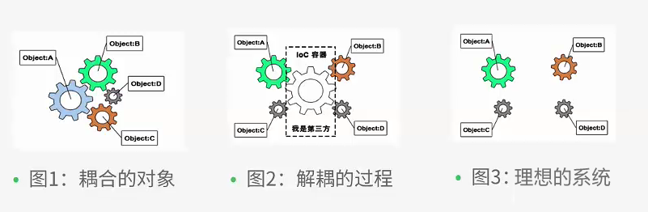
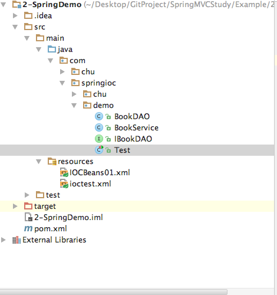
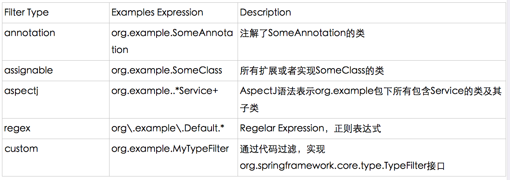

# Spring IOC 简介

控制反转IoC(Inversion of Control)，是一种设计思想，DI(依赖注入)是实现IoC的一种方法，也有人认为DI只是IoC的另一种说法。没有IoC的程序中我们使用面向对象编程对象的创建与对象间的依赖关系完全硬编码在程序中，对象的创建由程序自己控制，控制反转后将对象的创建转移给第三方，个人认为所谓控制反转就是：获得依赖对象的方式反转了。

 
 
 IoC是Spring框架的核心内容，使用多种方式完美的实现了IoC，可以使用XML配置，也可以使用注解，新版本的Spring也可以零配置实现IoC。Spring容器在初始化时先读取配置文件，根据配置文件或元数据创建与组织对象存入容器中，程序使用时再从Ioc容器中取出需要的对象。
 
  
  
  采用XML方式配置Bean的时候，Bean的定义信息是和实现分离的，而采用注解的方式可以把两者合为一体，Bean的定义信息直接以注解的形式定义在实现类中，从而达到了零配置的目的。
 
 


## 1 使用XML配置的方式实现Spring IOC

假设项目中需要完成对图书的数据访问服务，我们定义好了IBookDAO接口与BookDAO实现类

IBookDAO接口如下：

```
package com.springioc.demo;

/**
 * Created by chuguangming on 16/8/18.
 */
/**
 * 图书数据访问接口
 */
public interface IBookDAO {
    /**
     * 添加图书
     */
    public String addBook(String bookname);
}

```

BookDAO实现类如下：

```
package com.springioc.demo;

/**
 * Created by chuguangming on 16/8/18.
 */
/**
 * 图书数据访问实现类
 */
public class BookDAO implements IBookDAO {

    public String addBook(String bookname) {
        return "添加图书"+bookname+"成功！";
    }
}

```
业务类BookService如下：

```
package com.springioc.demo;

import org.springframework.context.ApplicationContext;
import org.springframework.context.support.ClassPathXmlApplicationContext;

/**
 * 图书业务类
 */
public class BookService {
    IBookDAO bookDAO;

    public BookService() {
        //容器
        ApplicationContext ctx=new ClassPathXmlApplicationContext("IOCBeans01.xml");
        //从容器中获得id为bookdao的bean
        bookDAO=(IBookDAO)ctx.getBean("bookdao");
    }

    public void storeBook(String bookname){
        System.out.println("图书上货");
        String result=bookDAO.addBook(bookname);
        System.out.println(result);
    }
}

```

容器的配置文件IOCBeans01.xml如下：

```
<?xml version="1.0" encoding="UTF-8"?>
<beans xmlns="http://www.springframework.org/schema/beans"
       xmlns:xsi="http://www.w3.org/2001/XMLSchema-instance"
       xmlns:p="http://www.springframework.org/schema/p"
       xsi:schemaLocation="http://www.springframework.org/schema/beans
        http://www.springframework.org/schema/beans/spring-beans.xsd">
    <bean id="bookdao" class="com.springioc.demo.BookDAO"></bean>
</beans>
```

测试类Test如下：

```
package com.springioc.demo;

/**
 * Created by chuguangming on 16/8/18.
 */
public class Test {
    @org.junit.Test
    public void testStoreBook()
    {
        BookService bookservice=new BookService();
        bookservice.storeBook("《Spring MVC权威指南 第一版》");
    }
}

```

Maven项目的pom.xml如下：

```
<?xml version="1.0" encoding="UTF-8"?>
<project xmlns="http://maven.apache.org/POM/4.0.0"
         xmlns:xsi="http://www.w3.org/2001/XMLSchema-instance"
         xsi:schemaLocation="http://maven.apache.org/POM/4.0.0 http://maven.apache.org/xsd/maven-4.0.0.xsd">
    <modelVersion>4.0.0</modelVersion>

    <groupId>com.chu</groupId>
    <artifactId>SpringDemo</artifactId>
    <version>1.0-SNAPSHOT</version>
    <build>
        <plugins>
            <plugin>
                <groupId>org.apache.maven.plugins</groupId>
                <artifactId>maven-compiler-plugin</artifactId>
                <configuration>
                    <source>1.6</source>
                    <target>1.6</target>
                </configuration>
            </plugin>
        </plugins>
    </build>
    <dependencies>

        <!-- https://mvnrepository.com/artifact/org.springframework/spring-core -->
        <dependency>
            <groupId>org.springframework</groupId>
            <artifactId>spring-core</artifactId>
            <version>4.3.2.RELEASE</version>
        </dependency>
        <dependency>
                <groupId>org.springframework</groupId>
                <artifactId>spring-context</artifactId>
                <version>4.3.2.RELEASE</version>
        </dependency>

    </dependencies>

    <repositories>
        <repository>
            <id>jboss</id>
            <url>http://maven.aliyun.com/nexus/content/groups/public/</url>
        </repository>
    </repositories>

</project>
```

项目框架结构:




## 2 使用Spring注解配置IOC

 上一个示例是使用传统的xml配置完成IOC的，如果内容比较多则配置需花费很多时间，通过注解可以减轻工作量，但注解后修改要麻烦一些，偶合度会增加，应该根据需要选择合适的方法。
 
 **BookDAO类**
 
 ```
 package com.springioc.annotation.demo;

import org.springframework.stereotype.Component;
import org.springframework.stereotype.Repository;

/**
 * 图书数据访问实现类
 */
@Component("bookdaoObj")
public class BookDAO implements IBookDAO {

    public String addBook(String bookname) {
        return "添加图书"+bookname+"成功！";
    }
}

 ```
 
 在类上增加了一个注解Component，在类的开头使用了@Component注解，它可以被Spring容器识别，启动Spring后，会自动把它转成容器管理的Bean。

除了@Component外，Spring提供了3个功能基本和@Component等效的注解，分别对应于用于对DAO，Service，和Controller进行注解。

1. @Repository 用于对DAO实现类进行注解。
2. @Service 用于对业务层注解，但是目前该功能与 @Component 相同。
3. @Constroller用于对控制层注解，但是目前该功能与 @Component 相同。
 
 
 **BookService类**
 
 ```
 package com.springioc.annotation.demo;
import org.springframework.context.ApplicationContext;
import org.springframework.context.support.ClassPathXmlApplicationContext;
import org.springframework.stereotype.Component;
import org.springframework.stereotype.Service;
/**
 * 图书业务类
 */
@Component
public class BookService {
    IBookDAO bookDAO;

    public void storeBook(String bookname){
        //容器
        ApplicationContext ctx=new ClassPathXmlApplicationContext("IOCBeans02.xml");
        //从容器中获得id为bookdao的bean
        bookDAO=(IBookDAO)ctx.getBean("bookdaoObj");
        System.out.println("图书上货");
        String result=bookDAO.addBook(bookname);
        System.out.println(result);
    }
}

 ```
 
 将构造方法中的代码直接写在了storeBook方法中，避免循环加载的问题。
IOCBeans02.xml
 
 ```
 <?xml version="1.0" encoding="UTF-8"?>
<beans xmlns="http://www.springframework.org/schema/beans"
       xmlns:xsi="http://www.w3.org/2001/XMLSchema-instance"
       xmlns:p="http://www.springframework.org/schema/p"
       xmlns:context="http://www.springframework.org/schema/context"
       xsi:schemaLocation="http://www.springframework.org/schema/beans
        http://www.springframework.org/schema/beans/spring-beans.xsd
        http://www.springframework.org/schema/context
        http://www.springframework.org/schema/context/spring-context-4.3.xsd">
    <context:component-scan base-package="com.springioc.annotation.demo"></context:component-scan>
</beans>
 ```
 
 
 粗体字是新增的xml命名空间与模式约束文件位置。增加了注解扫描的范围，指定了一个包，可以通过属性设置更加精确的范围如：
 
```
<context>标记常用属性配置:
resource-pattern：对指定的基包下面的子包进行选取
<context>子标记：
include-filter：指定需要包含的包
exclude-filter：指定需要排除的包
<!-- 自动扫描com.zhangguo.anno.bo中的类进行扫描 --> 
<context:component-scan base-package="com.zhangguo.anno" resource-pattern="bo/*.class" />

<context:component-scan base-package="com.zhangguo.anno" >

  <context:include-filter type="aspectj“ expression="com.zhangguo.anno.dao.*.*"/>
  <context:exclude-filter type=“aspectj” expression=“com.zhangguo.anno.entity.*.*”/>

</context:component-scan>
```
include-filter表示需要包含的目标类型，exclude-filter表示需要排除的目标类型，type表示采的过滤类型，共有如下5种类型：



expression表示过滤的表达式。

```
    <!-- 1、如果仅希望扫描特定的类而非基包下的所有类，可使用resource-pattern属性过滤特定的类 -->
    <context:component-scan base-package="com.zhangguo.Spring051"
        resource-pattern="ioc04/A*.class">
    </context:component-scan>
```

只扫描com.zhangguo.Spring051.ioc04下所有名称以A开始的类。

```
     <!--2、扫描注解了org.springframework.stereotype.Repository的类
     exclude-filter表示排除，include-filter表示包含，可以有多个-->
    <context:component-scan base-package="com.zhangguo.Spring051.ioc04"> 
        <context:exclude-filter type="annotation" expression="org.springframework.stereotype.Repository" />
        <context:include-filter type="annotation" expression="org.springframework.stereotype.Service"/>
    </context:component-scan>

```

```
<!--3、aspectj类型，扫描dao下所有的类，排除entity下所有的类-->
  <context:component-scan base-package="com.zhangguo.anno" >
  <context:include-filter type="aspectj" expression="com.zhangguo.anno.dao.*.*"/>
  <context:exclude-filter type="aspectj" expression="com.zhangguo.anno.entity.*.*"/>
</context:component-scan>
```

测试类

```
package com.springioc.annotation.demo;

import org.springframework.context.ApplicationContext;
import org.springframework.context.support.ClassPathXmlApplicationContext;

public class Test {
    @org.junit.Test
    public void testStoreBook()
    {
        //容器
        ApplicationContext ctx=new ClassPathXmlApplicationContext("IOCBeans02.xml");
        BookService bookservice=ctx.getBean(BookService.class);
        bookservice.storeBook("《Spring MVC权威指南 第二版》");
    }
}

```

## 3 自动装配

从上一个示例中可以看出有两个位置都使用了ApplicationContext初始化容器后获得需要的Bean，可以通过自动装配简化。

修改BookDAO

```
package com.springioc.autoannotation.demo;

import org.springframework.stereotype.Component;
import org.springframework.stereotype.Repository;

/**
 * 图书数据访问实现类
 */
@Repository
public class BookDAO implements IBookDAO {

    public String addBook(String bookname) {
        return "添加图书"+bookname+"成功！";
    }
}


```

把注解修改成了Repository，比Component更贴切一些，非必要。

修改BookService

```
package com.springioc.autoannotation.demo;

import org.springframework.beans.factory.annotation.Autowired;
import org.springframework.context.ApplicationContext;
import org.springframework.context.support.ClassPathXmlApplicationContext;
import org.springframework.stereotype.Service;

/**
 * 图书业务类
 */
@Service
public class BookService {
    @Autowired
    IBookDAO bookDAO;

    public void storeBook(String bookname){
        System.out.println("图书上货");
        String result=bookDAO.addBook(bookname);
        System.out.println(result);
    }
}
```

将类BookService上的注解替换成了Service；在bookDao成员变量上增加了一个注解@Autowired，该注解的作用是：可以对成员变量、方法和构造函数进行注解，来完成自动装配的工作，通俗来说就是会根据类型从容器中自动查到到一个Bean给bookDAO字段。@Autowired是根据类型进行自动装配的，如果需要按名称进行装配，则需要配合@Qualifier。另外可以使用其它注解，@ Resource ：等同于@Qualifier，@Inject：等同于@ Autowired。

@Service用于注解业务层组件（我们通常定义的service层就用这个）

@Controller用于注解控制层组件（如struts中的action）

@Repository用于注解数据访问组件，即DAO组件

@Component泛指组件，当组件不好归类的时候，我们可以使用这个注解进行注解。

装配注解主要有：@Autowired、@Qualifier、@Resource，它们的特点是：

1、@Resource默认是按照名称来装配注入的，只有当找不到与名称匹配的bean才会按照类型来装配注入；

2、@Autowired默认是按照类型装配注入的，如果想按照名称来转配注入，则需要结合@Qualifier一起使用；

3、@Resource注解是又J2EE提供，而@Autowired是由spring提供，故减少系统对spring的依赖建议使用@Resource的方式；如果Maven项目是1.5的JRE则需换成更高版本的。

4、@Resource和@Autowired都可以书写注解在字段或者该字段的setter方法之上

5、@Autowired 可以对成员变量、方法以及构造函数进行注释，而 @Qualifier 的注解对象是成员变量、方法入参、构造函数入参。

6、@Qualifier("XXX") 中的 XX是 Bean 的名称，所以 @Autowired 和 @Qualifier 结合使用时，自动注入的策略就从 byType 转变成 byName 了。

7、@Autowired 注释进行自动注入时，Spring 容器中匹配的候选 Bean 数目必须有且仅有一个，通过属性required可以设置非必要。

8、@Resource装配顺序

* 8.1. 如果同时指定了name和type，则从Spring上下文中找到唯一匹配的bean进行装配，找不到则抛出异常
* 8.2. 如果指定了name，则从上下文中查找名称（id）匹配的bean进行装配，找不到则抛出异常
* 8.3. 如果指定了type，则从上下文中找到类型匹配的唯一bean进行装配，找不到或者找到多个，都会抛出异常
* 8.4. 如果既没有指定name，又没有指定type，则自动按照byName方式进行装配；如果没有匹配，则回退为一个原始类型进行匹配，如果匹配则自动装配；

运行测试

```
package com.springioc.autoannotation.demo;

import org.springframework.context.ApplicationContext;
import org.springframework.context.support.ClassPathXmlApplicationContext;

public class Test {
    @org.junit.Test
    public void testStoreBook()
    {
        //容器
        ApplicationContext ctx=new ClassPathXmlApplicationContext("IOCBeans03.xml");
        BookService bookservice=ctx.getBean(BookService.class);
        bookservice.storeBook("《Spring MVC权威指南 第三版》");
    }
}

```

IOCBeans03.xml

```
<?xml version="1.0" encoding="UTF-8"?>
<beans xmlns="http://www.springframework.org/schema/beans"
       xmlns:xsi="http://www.w3.org/2001/XMLSchema-instance"
       xmlns:p="http://www.springframework.org/schema/p"
       xmlns:context="http://www.springframework.org/schema/context"
       xsi:schemaLocation="http://www.springframework.org/schema/beans
        http://www.springframework.org/schema/beans/spring-beans.xsd
        http://www.springframework.org/schema/context
        http://www.springframework.org/schema/context/spring-context-4.3.xsd">
    <context:component-scan base-package="com.springioc.autoannotation.demo"></context:component-scan>
</beans>
```

## 4 零配置实现IOC
所谓的零配置就是不再使用xml文件来初始化容器，使用一个类型来替代，

 IBookDAO代码如下：
 
 ```
 package com.springioc.zero.demo;

/**
 * 图书数据访问接口
 */
public interface IBookDAO {
    /**
     * 添加图书
     */
    public String addBook(String bookname);
}
 ```
 
 IBookDAO的实现类BookDAO代码如下：
 
 ```
 package com.springioc.zero.demo;

import org.springframework.stereotype.Component;
import org.springframework.stereotype.Repository;

/**
 * 图书数据访问实现类
 */
@Repository
public class BookDAO implements IBookDAO {

    public String addBook(String bookname) {
        return "添加图书"+bookname+"成功！";
    }
}


 ```
 
 在BookDAO类上注解了@Repository当初始化时该类将被容器管理会生成一个Bean，可以通过构造方法测试。

业务层BookService代码如下：

```
package com.springioc.zero.demo;

import javax.annotation.Resource;

import org.springframework.stereotype.Service;

/**
 * 图书业务类
 */
@Service
public class BookService {
    @Resource
    IBookDAO bookDAO;

    public void storeBook(String bookname){
        System.out.println("图书上货");
        String result=bookDAO.addBook(bookname);
        System.out.println(result);
    }
}
```

类BookService将对容器管理因为注解了@Service，初始化时会生成一个单例的Bean，类型为BookService。在字段bookDAO上注解了@Resource，用于自动装配，Resource默认是按照名称来装配注入的，只有当找不到与名称匹配的bean才会按照类型来装配注入。

新增一个用于替代原xml配置文件的ApplicationCfg类，代码如下：

```
package com.springioc.zero.demo;

import org.springframework.context.annotation.Bean;
import org.springframework.context.annotation.ComponentScan;
import org.springframework.context.annotation.Configuration;

/**
 * 容器的配置类
 */
@Configuration
@ComponentScan(basePackages="com.springioc.zero.demo")
public class ApplicationCfg {
    @Bean
    public User getUser(){
        return new User("成功");
    }
}

```

@Configuration相当于配置文件中的<beans/>，ComponentScan相当于配置文件中的context:component-scan，属性也一样设置

,@Bean相当于<bean/>，只能注解在方法和注解上，一般在方法上使用，源码中描述：@Target({ElementType.METHOD, ElementType.ANNOTATION_TYPE})，方法名相当于id。中间使用到了User，User类的代码如下：


```
package com.springioc.zero.demo;

import org.springframework.stereotype.Component;

@Component("user1")
public class User {
    public User() {
        System.out.println("创建User对象");
    }
    public User(String msg) {
        System.out.println("创建User对象"+msg);
    }
    public void show(){
        System.out.println("一个学生对象！");
    }
}

```

初始化容器的代码与以前有一些不一样，具体如下：

```
package com.springioc.zero.demo;

import org.springframework.context.ApplicationContext;
import org.springframework.context.annotation.AnnotationConfigApplicationContext;

public class Test {
    @org.junit.Test
    public void testStoreBook()
    {
        //容器，注解配置应用程序容器，Spring通过反射ApplicationCfg.class初始化容器
        ApplicationContext ctx=new AnnotationConfigApplicationContext(ApplicationCfg.class);
        BookService bookservice=ctx.getBean(BookService.class);
        bookservice.storeBook("《Spring MVC权威指南 第四版》");
        User user1=ctx.getBean("user1",User.class);
        user1.show();
        User getUser=ctx.getBean("getUser",User.class);
        getUser.show();
    }
}

```

容器的初始化通过一个类型完成，Spring通过反射ApplicationCfg.class初始化容器，中间user1与getUser是否为相同的Bean呢？

答案是否定的，因为在ApplicationCfg中声明的方法getUser当相于在xml文件中定义了一个<bean id="getUser" class="..."/>，在User类上注解@Component("user1")相当于另一个<bean id="user1" class="..."/>。


小结：使用零配置和注解虽然方便，不需要编写麻烦的xml文件，但并非为了取代xml，应该根据实例需要选择，或二者结合使用，毕竟使用一个类作为容器的配置信息是硬编码的，不好在发布后修改。

