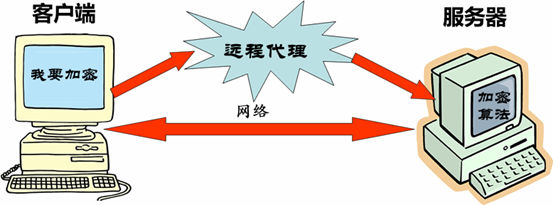
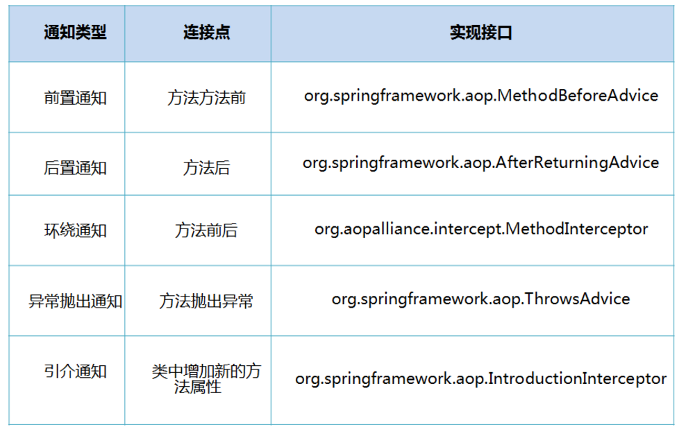

# Spring AOP 简介

因为某个对象消耗太多资源,而且你的代码并不是每个逻辑路径都需要此对象, 你曾有过延迟创建对象的想法吗 ( if和else就是不同的两条逻辑路径) ? 你有想过限制访问某个对象,也就是说,提供一组方法给普通用户,特别方法给管理员用户?以上两种需求都非常类似，并且都需要解决一个更大的问题:你如何提供一致的接口给某个对象让它可以改变其内部功能,或者是从来不存在的功能? 可以通过引入一个新的对象，来实现对真实对象的操作或者将新的对象作为真实对象的一个替身。即代理对象。它可以在客户端和目标对象之间起到中介的作用，并且可以通过代理对象去掉客户不能看到的内容和服务或者添加客户需要的额外服务。

例子1：经典例子就是网络代理，你想访问facebook或者twitter ，如何绕过GFW，找个代理网站。

例子2：可以调用远程代理处理一些操作如图：

 
 
 2.问题:

你怎样才能在不直接操作对象的情况下,对此对象进行访问?

3.解决方案

代理模式: 为其他对象提供一种代理，并以控制对这个对象的访问。（Provide asurrogate or placeholder foranother object tocontrol access to it. ）而对一个对象进行访问控制的一个原因是为了只有在我们确实需要这个对象时才对它进行创建和初始化。它是给某一个对象提供一个替代者(占位者),使之在client对象和subject对象之间编码更有效率。代理可以提供延迟实例化(lazy instantiation),控制访问, 等等，包括只在调用中传递。 一个处理纯本地资源的代理有时被称作虚拟代理。远程服务的代理常常称为远程代理。强制 控制访问的代理称为保护代理。

4.实用性

在需要用比较通用和复杂的对象指针代替简单的指针的时候，使用 Proxy模式。下面是一些可以使用Proxy模式常见情况：
1) 远程代理（Remote  Proxy）为一个位于不同的地址空间的对象提供一个本地的代理对象。这个不同的地址空间可以是在同一台主机中，也可是在另一台主机中，远程代理又叫做大使(Ambassador)
2) 虚拟代理（Virtual Proxy）根据需要创建开销很大的对象。如果需要创建一个资源消耗较大的对象，先创建一个消耗相对较小的对象来表示，真实对象只在需要时才会被真正创建。 
3) 保护代理（Protection Proxy）控制对原始对象的访问。保护代理用于对象应该有不同的访问权限的时候。
4) 智能指引（Smart Reference）取代了简单的指针，它在访问对象时执行一些附加操作。
5) Copy-on-Write代理：它是虚拟代理的一种，把复制（克隆）操作延迟到只有在客户端真正需要时才执行。一般来说，对象的深克隆是一个开销较大的操作，Copy-on-Write代理可以让这个操作延迟，只有对象被用到的时候才被克隆。

 
 
##例子

我们创建一个Math类

```
package com.proxy;

/**
 * Created by chuguangming on 16/8/19.
 */
public class Math {
    //加
    public int add(int n1,int n2){
        int result=n1+n2;
        System.out.println(n1+"+"+n2+"="+result);
        return result;
    }


    //减
    public int sub(int n1,int n2){
        int result=n1-n2;
        System.out.println(n1+"-"+n2+"="+result);
        return result;
    }

    //乘
    public int mut(int n1,int n2){
        int result=n1*n2;
        System.out.println(n1+"X"+n2+"="+result);
        return result;
    }

    //除
    public int div(int n1,int n2){
        int result=n1/n2;
        System.out.println(n1+"/"+n2+"="+result);
        return result;
    }
}

```

现在需求发生了变化，要求项目中所有的类在执行方法时输出执行耗时。最直接的办法是修改源代码，如下所示：

```
package com.proxy;

/**
 * Created by chuguangming on 16/8/19.
 */
import java.util.Random;

public class Math2 {
    //加
    public int add(int n1, int n2) {
        //开始时间
        long start = System.currentTimeMillis();
        lazy();
        int result = n1 + n2;
        System.out.println(n1 + "+" + n2 + "=" + result);
        Long span = System.currentTimeMillis() - start;
        System.out.println("共用时：" + span);
        return result;
    }

    //减
    public int sub(int n1, int n2) {
        //开始时间
        long start = System.currentTimeMillis();
        lazy();
        int result = n1 - n2;
        System.out.println(n1 + "-" + n2 + "=" + result);
        Long span = System.currentTimeMillis() - start;
        System.out.println("共用时：" + span);
        return result;
    }

    //乘
    public int mut(int n1, int n2) {
        //开始时间
        long start = System.currentTimeMillis();
        lazy();
        int result = n1 * n2;
        System.out.println(n1 + "X" + n2 + "=" + result);
        Long span = System.currentTimeMillis() - start;
        System.out.println("共用时：" + span);
        return result;
    }

    //除
    public int div(int n1, int n2) {
        //开始时间
        long start = System.currentTimeMillis();
        lazy();
        int result = n1 / n2;
        System.out.println(n1 + "/" + n2 + "=" + result);
        Long span = System.currentTimeMillis() - start;
        System.out.println("共用时：" + span);
        return result;
    }

    //模拟延时
    public void lazy() {
        try {
            int n = (int) new Random().nextInt(500);
            Thread.sleep(n);
        } catch (InterruptedException e) {
            e.printStackTrace();
        }
    }
}

```

测试运行：

```
package com.proxy;

import com.springioc.annotation.demo.BookService;
import org.springframework.context.ApplicationContext;
import org.springframework.context.support.ClassPathXmlApplicationContext;

/**
 * Created by chuguangming on 16/8/19.
 */
public class Test {

    @org.junit.Test
    public void test01()
    {
        Math math=new Math();
        int n1=100,n2=5;
        math.add(n1, n2);
        math.sub(n1, n2);
        math.mut(n1, n2);
        math.div(n1, n2);
    }
    
    @org.junit.Test
    public void test02()
    {
        Math2 math=new Math2();
        int n1=100,n2=5;
        math.add(n1, n2);
        math.sub(n1, n2);
        math.mut(n1, n2);
        math.div(n1, n2);
    }
}

```

缺点：

1、工作量特别大，如果项目中有多个类，多个方法，则要修改多次。

2、违背了设计原则：开闭原则（OCP），对扩展开放，对修改关闭，而为了增加功能把每个方法都修改了，也不便于维护。

3、违背了设计原则：单一职责（SRP），每个方法除了要完成自己本身的功能，还要计算耗时、延时；每一个方法引起它变化的原因就有多种。

4、违背了设计原则：依赖倒转（DIP），抽象不应该依赖细节，两者都应该依赖抽象。而在Test类中，Test与Math都是细节。

使用静态代理可以解决部分问题。

##二、静态代理
 1、定义抽象主题接口。
 
 ```
 package com.prxoy2;

/**
 * Created by chuguangming on 16/8/19.
 */
/**
 * 接口
 * 抽象主题
 */
public interface IMath {
    //加
    int add(int n1, int n2);

    //减
    int sub(int n1, int n2);

    //乘
    int mut(int n1, int n2);

    //除
    int div(int n1, int n2);

}

 ```
 
 2、主题类，算术类，实现抽象接口。
 
 ```
 package com.prxoy2;

/**
 * Created by chuguangming on 16/8/19.
 */
/**
 * 被代理的目标对象
 *真实主题
 */
public class Math implements IMath {
    //加
    public int add(int n1,int n2){
        int result=n1+n2;
        System.out.println(n1+"+"+n2+"="+result);
        return result;
    }

    //减
    public int sub(int n1,int n2){
        int result=n1-n2;
        System.out.println(n1+"-"+n2+"="+result);
        return result;
    }

    //乘
    public int mut(int n1,int n2){
        int result=n1*n2;
        System.out.println(n1+"X"+n2+"="+result);
        return result;
    }

    //除
    public int div(int n1,int n2){
        int result=n1/n2;
        System.out.println(n1+"/"+n2+"="+result);
        return result;
    }
}
 ```
 
 3、代理类
 
 ```
 package com.prxoy2;

/**
 * Created by chuguangming on 16/8/19.
 */
import java.util.Random;

/**
 * 静态代理类
 */
public class MathProxy implements IMath {

    //被代理的对象
    IMath math = new Math();

    //加
    public int add(int n1, int n2) {
        //开始时间
        long start = System.currentTimeMillis();
        lazy();
        int result = math.add(n1, n2);
        Long span = System.currentTimeMillis() - start;
        System.out.println("共用时：" + span);
        return result;
    }

    //减法
    public int sub(int n1, int n2) {
        //开始时间
        long start = System.currentTimeMillis();
        lazy();
        int result = math.sub(n1, n2);
        Long span = System.currentTimeMillis() - start;
        System.out.println("共用时：" + span);
        return result;
    }

    //乘
    public int mut(int n1, int n2) {
        //开始时间
        long start = System.currentTimeMillis();
        lazy();
        int result = math.mut(n1, n2);
        Long span = System.currentTimeMillis() - start;
        System.out.println("共用时：" + span);
        return result;
    }

    //除
    public int div(int n1, int n2) {
        //开始时间
        long start = System.currentTimeMillis();
        lazy();
        int result = math.div(n1, n2);
        Long span = System.currentTimeMillis() - start;
        System.out.println("共用时：" + span);
        return result;
    }

    //模拟延时
    public void lazy() {
        try {
            int n = (int) new Random().nextInt(500);
            Thread.sleep(n);
        } catch (InterruptedException e) {
            e.printStackTrace();
        }
    }
}

 ```
 
 4、测试运行
 
 ```
 package com.prxoy2;

/**
 * Created by chuguangming on 16/8/19.
 */
public class Test {

    IMath math=new MathProxy();
    @org.junit.Test
    public void test01()
    {
        int n1=100,n2=5;
        math.add(n1, n2);
        math.sub(n1, n2);
        math.mut(n1, n2);
        math.div(n1, n2);
    }
}

 ```
 
 5、小结

通过静态代理，是否完全解决了上述的4个问题：

已解决：

5.1、解决了“开闭原则（OCP）”的问题，因为并没有修改Math类，而扩展出了MathProxy类。

5.2、解决了“依赖倒转（DIP）”的问题，通过引入接口。

5.3、解决了“单一职责（SRP）”的问题，Math类不再需要去计算耗时与延时操作，但从某些方面讲MathProxy还是存在该问题。

未解决：

5.4、如果项目中有多个类，则需要编写多个代理类，工作量大，不好修改，不好维护，不能应对变化。

如果要解决上面的问题，可以使用动态代理。

## 三、动态代理，使用JDK内置的Proxy实现
只需要一个代理类，而不是针对每个类编写代理类。

在上一个示例中修改代理类MathProxy如下：

```
package com.prxoy2;

/**
 * Created by chuguangming on 16/8/19.
 */
import java.lang.reflect.InvocationHandler;
import java.lang.reflect.Method;
import java.lang.reflect.Proxy;
import java.util.Random;

/**
 * 动态代理类
 */
public class DynamicProxy implements InvocationHandler {

    //被代理的对象
    Object targetObject;

    /**
     * 获得被代理后的对象
     * @param object 被代理的对象
     * @return 代理后的对象
     */
    public Object getProxyObject(Object object){
        this.targetObject=object;
        return Proxy.newProxyInstance(
                targetObject.getClass().getClassLoader(), //类加载器
                targetObject.getClass().getInterfaces(),  //获得被代理对象的所有接口
                this);  //InvocationHandler对象
        //loader:一个ClassLoader对象，定义了由哪个ClassLoader对象来生成代理对象进行加载
        //interfaces:一个Interface对象的数组，表示的是我将要给我需要代理的对象提供一组什么接口，如果我提供了一组接口给它，那么这个代理对象就宣称实现了该接口(多态)，这样我就能调用这组接口中的方法了
        //h:一个InvocationHandler对象，表示的是当我这个动态代理对象在调用方法的时候，会关联到哪一个InvocationHandler对象上，间接通过invoke来执行
    }


    /**
     * 当用户调用对象中的每个方法时都通过下面的方法执行，方法必须在接口
     * proxy 被代理后的对象
     * method 将要被执行的方法信息（反射）
     * args 执行方法时需要的参数
     */
    public Object invoke(Object proxy, Method method, Object[] args) throws Throwable {
        //被织入的内容，开始时间
        long start=System.currentTimeMillis();
        lazy();

        //使用反射在目标对象上调用方法并传入参数
        Object result=method.invoke(targetObject, args);

        //被织入的内容，结束时间
        Long span= System.currentTimeMillis()-start;
        System.out.println("共用时："+span);

        return result;
    }

    //模拟延时
    public void lazy()
    {
        try {
            int n=(int)new Random().nextInt(500);
            Thread.sleep(n);
        } catch (InterruptedException e) {
            e.printStackTrace();
        }
    }

}

```

测试运行：

```
package com.prxoy2;

/**
 * Created by chuguangming on 16/8/19.
 */
public class Test2 {

    //实例化一个MathProxy代理对象
    //通过getProxyObject方法获得被代理后的对象
    IMath math=(IMath)new DynamicProxy().getProxyObject(new Math());
    @org.junit.Test
    public void test01()
    {
        int n1=100,n2=5;
        math.add(n1, n2);
        math.sub(n1, n2);
        math.mut(n1, n2);
        math.div(n1, n2);
    }
}

```

小结：

JDK内置的Proxy动态代理可以在运行时动态生成字节码，而没必要针对每个类编写代理类。中间主要使用到了一个接口InvocationHandler与Proxy.newProxyInstance静态方法，参数说明如下：

 使用内置的Proxy实现动态代理有一个问题：被代理的类必须实现接口，未实现接口则没办法完成动态代理。

如果项目中有些类没有实现接口，则不应该为了实现动态代理而刻意去抽出一些没有实例意义的接口，通过cglib可以解决该问题。

##五、使用Spring XML 实现AOP
SpringAOP中，通过Advice定义横切逻辑，Spring中支持5种类型的Advice:
 

5.1、新建 一个Maven项目，在项目中引入Spring核心库与AOP，修改pom.xml文件，在dependencies中增加如下节点：

```
<?xml version="1.0" encoding="UTF-8"?>
<project xmlns="http://maven.apache.org/POM/4.0.0"
         xmlns:xsi="http://www.w3.org/2001/XMLSchema-instance"
         xsi:schemaLocation="http://maven.apache.org/POM/4.0.0 http://maven.apache.org/xsd/maven-4.0.0.xsd">
    <modelVersion>4.0.0</modelVersion>

    <groupId>com.chu</groupId>
    <artifactId>SpringDemo</artifactId>
    <version>1.0-SNAPSHOT</version>
    <build>
        <plugins>
            <plugin>
                <groupId>org.apache.maven.plugins</groupId>
                <artifactId>maven-compiler-plugin</artifactId>
                <configuration>
                    <source>1.6</source>
                    <target>1.6</target>
                </configuration>
            </plugin>
        </plugins>
    </build>
    <dependencies>

        <!-- https://mvnrepository.com/artifact/org.springframework/spring-core -->
        <dependency>
            <groupId>org.springframework</groupId>
            <artifactId>spring-core</artifactId>
            <version>4.3.2.RELEASE</version>
        </dependency>
        <dependency>
                <groupId>org.springframework</groupId>
                <artifactId>spring-context</artifactId>
                <version>4.3.2.RELEASE</version>
        </dependency>
        <!-- https://mvnrepository.com/artifact/junit/junit -->
        <dependency>
            <groupId>junit</groupId>
            <artifactId>junit</artifactId>
            <version>4.12</version>
        </dependency>
        <dependency>
            <groupId>org.aspectj</groupId>
            <artifactId>aspectjweaver</artifactId>
            <version>1.8.9</version>
        </dependency>

    </dependencies>

    <repositories>
        <repository>
            <id>jboss</id>
            <url>http://maven.aliyun.com/nexus/content/groups/public/</url>
        </repository>
    </repositories>

</project>
```

创建要被代理的类

```
package com.aop;

/**
 * Created by chuguangming on 16/8/19.
 */
/**
 * 被代理的目标类
 */
public class Math{
    //加
    public int add(int n1,int n2){
        int result=n1+n2;
        System.out.println(n1+"+"+n2+"="+result);
        return result;
    }

    //减
    public int sub(int n1,int n2){
        int result=n1-n2;
        System.out.println(n1+"-"+n2+"="+result);
        return result;
    }

    //乘
    public int mut(int n1,int n2){
        int result=n1*n2;
        System.out.println(n1+"X"+n2+"="+result);
        return result;
    }

    //除
    public int div(int n1,int n2){
        int result=n1/n2;
        System.out.println(n1+"/"+n2+"="+result);
        return result;
    }
}

```

编辑AOP中需要使用到的通知类Advices.java代码如下：

```
package com.aop;

/**
 * Created by chuguangming on 16/8/19.
 */
import org.aspectj.lang.JoinPoint;

/**
 * 通知类，横切逻辑
 *
 */
public class Advices {

    public void before(JoinPoint jp){
        System.out.println("----------前置通知----------");
        System.out.println(jp.getSignature().getName());
    }

    public void after(JoinPoint jp){
        System.out.println("----------最终通知----------");
    }
}

```

##使用注解配置AOP


上一个示例中修改被代理的类Math,为了实现IOC扫描在Math类上注解了@Service并命名bean为math。相当于上一个示例中在xml配置文件中增加了一个bean，

```
    <!-- 被代理对象 -->
    <bean id="math" class="com.aop.Math"></bean>
```
，Math类的代码如下：

```
package com.aop2;

/**
 * Created by chuguangming on 16/8/19.
 */
import org.springframework.stereotype.Service;

/**
 * 被代理的目标类
 */
@Service("math")
public class Math{
    //加
    public int add(int n1,int n2){
        int result=n1+n2;
        System.out.println(n1+"+"+n2+"="+result);
        return result;
    }

    //减
    public int sub(int n1,int n2){
        int result=n1-n2;
        System.out.println(n1+"-"+n2+"="+result);
        return result;
    }

    //乘
    public int mut(int n1,int n2){
        int result=n1*n2;
        System.out.println(n1+"X"+n2+"="+result);
        return result;
    }

    //除
    public int div(int n1,int n2){
        int result=n1/n2;
        System.out.println(n1+"/"+n2+"="+result);
        return result;
    }
}

```

修改通知类Advices，代码中有3个注解，@Component表示该类的实例会被Spring IOC容器管理；@Aspect表示声明一个切面；@Before表示before为前置通知，通过参数execution声明一个切点，Advices.java代码如下所示：

```
package com.aop2;

/**
 * Created by chuguangming on 16/8/19.
 */
import org.aspectj.lang.JoinPoint;
import org.aspectj.lang.annotation.After;
import org.aspectj.lang.annotation.Aspect;
import org.aspectj.lang.annotation.Before;
import org.springframework.stereotype.Component;

/**
 * 通知类，横切逻辑
 *
 */
@Component
@Aspect
public class Advices {
    @Before("execution(* com.aop2.Math.*(..))")
    public void before(JoinPoint jp){
        System.out.println("----------前置通知----------");
        System.out.println(jp.getSignature().getName());
    }

    @After("execution(* com.aop2.Math.*(..))")
    public void after(JoinPoint jp){
        System.out.println("----------最终通知----------");
    }
}

```

上面的代码与下面的配置基本等同

```
    <!-- aop配置 -->
    <aop:config proxy-target-class="true">
        <!--切面 -->
        <aop:aspect ref="advices">
            <!-- 切点 -->
            <aop:pointcut expression="execution(* com.aop.Math.*(..))" id="pointcut1"/>
            <!--连接通知方法与切点 -->
            <aop:before method="before" pointcut-ref="pointcut1"/>
            <aop:after method="after" pointcut-ref="pointcut1"/>
        </aop:aspect>
    </aop:config>
```

新增配置文件aop02.xml，在配置IOC的基础上增加了aop:aspectj-autoproxy节点，Spring框架会自动为与AspectJ切面配置的Bean创建代理，proxy-target-class="true"属性表示被代理的目标对象是一个类，而非实现了接口的类，主要是为了选择不同的代理方式。

```
<?xml version="1.0" encoding="UTF-8"?>
<beans xmlns="http://www.springframework.org/schema/beans"
       xmlns:xsi="http://www.w3.org/2001/XMLSchema-instance"
       xmlns:p="http://www.springframework.org/schema/p"
       xmlns:aop="http://www.springframework.org/schema/aop"
       xmlns:context="http://www.springframework.org/schema/context"
       xsi:schemaLocation="http://www.springframework.org/schema/beans
        http://www.springframework.org/schema/beans/spring-beans.xsd
        http://www.springframework.org/schema/context
        http://www.springframework.org/schema/context/spring-context-4.3.xsd
        http://www.springframework.org/schema/aop
        http://www.springframework.org/schema/aop/spring-aop-4.3.xsd">
    <context:component-scan base-package="com.aop2">
    </context:component-scan>
    <aop:aspectj-autoproxy proxy-target-class="true"></aop:aspectj-autoproxy>
</beans>
```

测试

```
package com.aop2;

/**
 * Created by chuguangming on 16/8/19.
 */
import org.springframework.context.ApplicationContext;
import org.springframework.context.support.ClassPathXmlApplicationContext;

public class Test {

    public static void main(String[] args) {
        ApplicationContext ctx = new ClassPathXmlApplicationContext("aop02.xml");
        Math math = ctx.getBean("math", Math.class);
        int n1 = 100, n2 = 5;
        math.add(n1, n2);
        math.sub(n1, n2);
        math.mut(n1, n2);
        math.div(n1, n2);
    }

}
```
