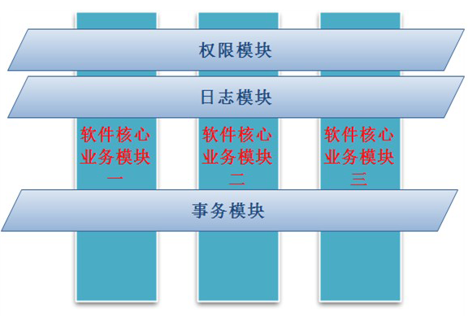
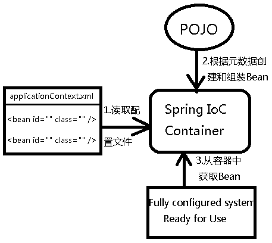

# Spring AOP 简介

AOP（Aspect Oriented Programming）面向切面编程，通过预编译方式和运行期动态代理实现程序功能的横向多模块统一控制的一种技术。AOP是OOP的补充，是Spring框架中的一个重要内容。利用AOP可以对业务逻辑的各个部分进行隔离，从而使得业务逻辑各部分之间的耦合度降低，提高程序的可重用性，同时提高了开发的效率。AOP可以分为静态织入与动态织入，静态织入即在编译前将需织入内容写入目标模块中，这样成本非常高。动态织入则不需要改变目标模块。Spring框架实现了AOP，使用注解配置完成AOP比使用XML配置要更加方便与直观。

 
 
 IoC是Spring框架的核心内容，使用多种方式完美的实现了IoC，可以使用XML配置，也可以使用注解，新版本的Spring也可以零配置实现IoC。Spring容器在初始化时先读取配置文件，根据配置文件或元数据创建与组织对象存入容器中，程序使用时再从Ioc容器中取出需要的对象。
 
  
  
  采用XML方式配置Bean的时候，Bean的定义信息是和实现分离的，而采用注解的方式可以把两者合为一体，Bean的定义信息直接以注解的形式定义在实现类中，从而达到了零配置的目的。
 
 

