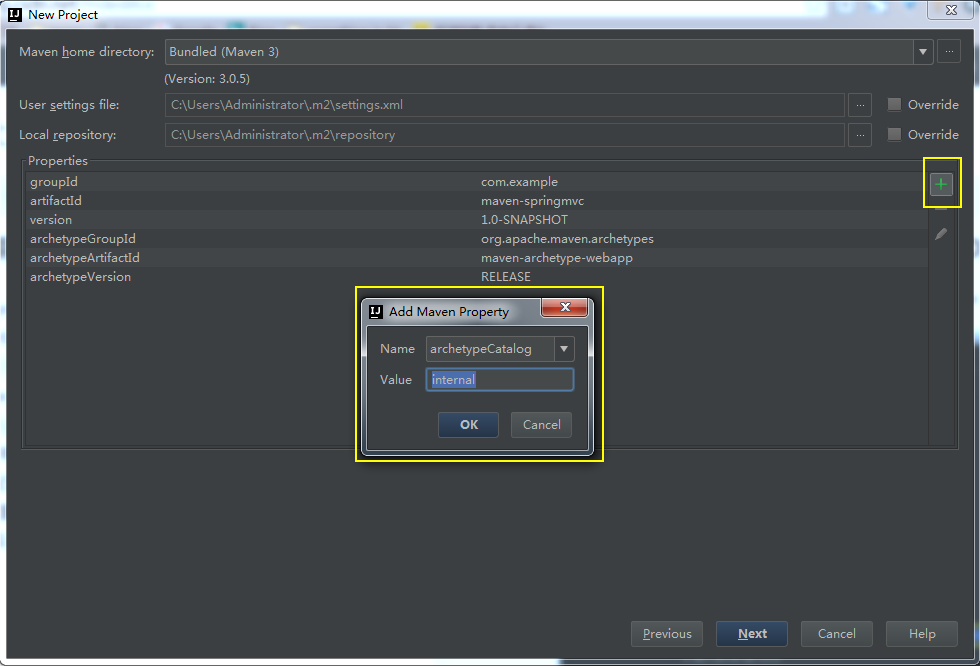
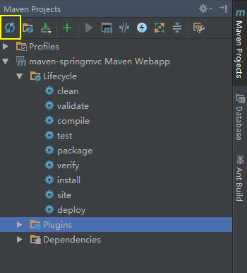
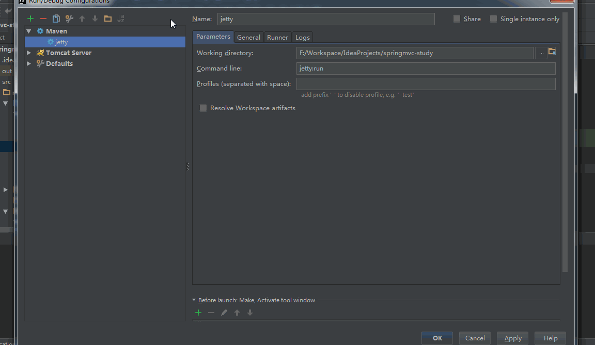
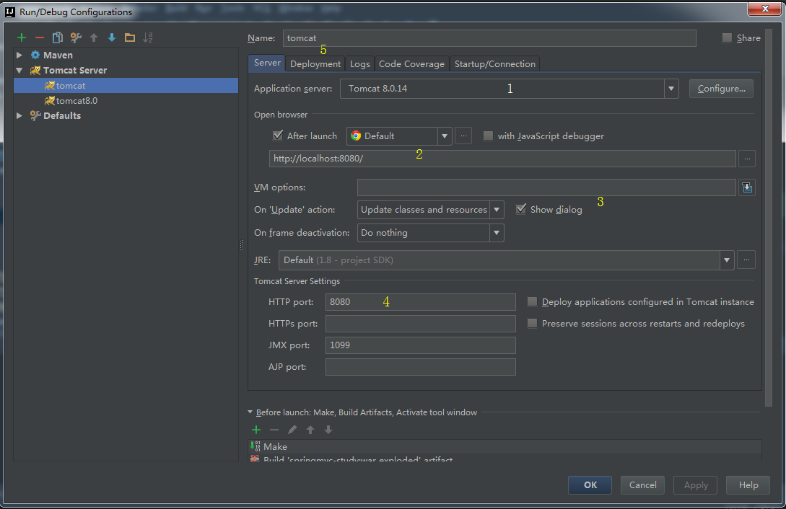
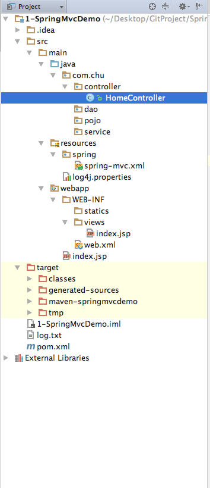

#Spring MVC 环境搭建

## 1 各软件版本

* IntelliJ IDEA 2016.1
* jdk1.8
* maven3.0.5
* tomcat或jetty

## 2 利用maven骨架建立一个webapp
选择create new project-Maven-Create from archetype。找到maven-archetype-webapp这个骨架，然后next。


输入GroupId和ArtifactId后下一步。


填写本地的maven环境，这里可以选择自己本地的环境，也可以用idea自带的maven3.0.5。配置相应的配置文件，idea自带的maven是没有配置文件的，需要单独配置的可以在相应的目录中添加setting.xml文件，例如需要配置jdk版本或者maven mirror的。



由于maven骨架和一些jar需要去maven的仓库下载，所以创建项目的时候速度会非常慢（外国的服务器你懂得），因此我们可以直接访问http://repo1.maven.org/maven2/archetype-catalog.xml，把这个xml下载下来放到本地的maven目录中，然后在添加一个参数archetypeCatalog=internal就可以了。
next 填写项目名称，finish即可。

## 3 建立相应的目录

项目创建完成后，src-main下建立java目录后，是无法在该目录下创建新的包和java类等文件的。在idea中需要对目录进行标注。


* Sources 一般用于标注类似 src 这种可编译目录。有时候我们不单单项目的 src 目录要可编译，还有其他一些特别的目录也许我们也要作为可编译的目录，就需要对该目录进行此标注。只有 Sources 这种可编译目录才可以新建 Java 类和包，这一点需要牢记。

* Tests 一般用于标注可编译的单元测试目录。在规范的 maven 项目结构中，顶级目录是 src，maven 的 src 我们是不会设置为 Sources 的，而是在其子目录 main 目录下的 java 目录，我们会设置为 Sources。而单元测试的目录是 src - test - java，这里的 java 目录我们就会设置为 Tests，表示该目录是作为可编译的单元测试目录。一般这个和后面几个我们都是在 maven 项目下进行配置的，但是我这里还是会先说说。从这一点我们也可以看出 IntelliJ IDEA 对 maven 项目的支持是比较彻底的。

* Resources 一般用于标注资源文件目录。在 maven 项目下，资源目录是单独划分出来的，其目录为：src - main -resources，这里的 resources 目录我们就会设置为 Resources，表示该目录是作为资源目录。资源目录下的文件是会被编译到输出目录下的。

* Test Resources 一般用于标注单元测试的资源文件目录。在 maven 项目下，单元测试的资源目录是单独划分出来的，其目录为：src - test -resources，这里的 resources 目录我们就会设置为 Test Resources，表示该目录是作为单元测试的资源目录。资源目录下的文件是会被编译到输出目录下的。

* Excluded 一般用于标注排除目录。被排除的目录不会被 IntelliJ IDEA 创建索引，相当于被 IntelliJ IDEA 废弃，该目录下的代码文件是不具备代码检查和智能提示等常规代码功能。
通过上面的介绍，我们知道对于非 maven 项目我们只要会设置 src 即可。

（引用自http://wiki.jikexueyuan.com/project/intellij-idea-tutorial/eclipse-java-web-project-introduce.html）

标注完后，建立如下的目录。


## 4 配置Maven和SpringMVC

配置Maven的pom.xml完整的配置文件如下。


```
<project xmlns="http://maven.apache.org/POM/4.0.0" xmlns:xsi="http://www.w3.org/2001/XMLSchema-instance"
  xsi:schemaLocation="http://maven.apache.org/POM/4.0.0 http://maven.apache.org/maven-v4_0_0.xsd">
  <modelVersion>4.0.0</modelVersion>
  <groupId>com.chu</groupId>
  <artifactId>maven-springmvcdemo</artifactId>
  <packaging>war</packaging>
  <version>1.0-SNAPSHOT</version>
  <name>maven-springmvcdemo Maven Webapp</name>
  <url>http://maven.apache.org</url>
  <dependencies>
    <!--日志包-->
    <dependency>
      <groupId>junit</groupId>
      <artifactId>junit</artifactId>
      <version>3.8.1</version>
      <scope>test</scope>
    </dependency>
    <dependency>
      <groupId>org.slf4j</groupId>
      <artifactId>slf4j-log4j12</artifactId>
      <version>1.7.21</version>
    </dependency>

    <!--j2ee相关包 servlet、jsp、jstl-->
    <dependency>
      <groupId>javax.servlet</groupId>
      <artifactId>javax.servlet-api</artifactId>
      <version>3.1.0</version>
    </dependency>
    <dependency>
      <groupId>javax.servlet.jsp</groupId>
      <artifactId>jsp-api</artifactId>
      <version>2.2</version>
    </dependency>
    <dependency>
      <groupId>javax.servlet</groupId>
      <artifactId>jstl</artifactId>
      <version>1.2</version>
    </dependency>

    <!--mysql驱动包-->
    <dependency>
      <groupId>mysql</groupId>
      <artifactId>mysql-connector-java</artifactId>
      <version>5.1.35</version>
    </dependency>

    <!--spring相关包-->
    <dependency>
      <groupId>org.springframework</groupId>
      <artifactId>spring-web</artifactId>
      <version>4.3.1.RELEASE</version>
    </dependency>
    <dependency>
      <groupId>org.springframework</groupId>
      <artifactId>spring-webmvc</artifactId>
      <version>4.3.1.RELEASE</version>
    </dependency>

    <!--其他需要的包-->
    <dependency>
      <groupId>org.apache.commons</groupId>
      <artifactId>commons-lang3</artifactId>
      <version>3.4</version>
    </dependency>
    <dependency>
      <groupId>commons-fileupload</groupId>
      <artifactId>commons-fileupload</artifactId>
      <version>1.3.1</version>
    </dependency>
  </dependencies>
  <build>
    <finalName>maven-springmvcdemo</finalName>
    <resources>
      <!--表示把java目录下的有关xml文件,properties文件编译/打包的时候放在resource目录下-->
      <resource>
        <directory>${basedir}/src/main/java</directory>
        <includes>
          <include>**/*.properties</include>
          <include>**/*.xml</include>
        </includes>
      </resource>
      <resource>
        <directory>${basedir}/src/main/resources</directory>
      </resource>
    </resources>
    <plugins>
      <!--servlet容器 jetty插件-->
      <plugin>
        <groupId>org.eclipse.jetty</groupId>
        <artifactId>jetty-maven-plugin</artifactId>
        <version>9.3.10.v20160621</version>
      </plugin>
    </plugins>
  </build>
  <repositories>
    <repository>
      <id>jboss</id>
      <url>http://maven.aliyun.com/nexus/content/groups/public/</url>
    </repository>
  </repositories>
</project>

```

更新完pom.xml文件后，idea应该会自动下载相应的jar包（可能需要vpn），如果没有自动下载的话，可以点击“Reimport All Maven Projects”按钮进行项目的重新载入。如图所示。



jar下载完成后，所有项目所需的依赖就已经添加完成了。

##5 配置web.xml
maven默认生成的web.xml版本是2.3的，所以有些配置节点idea会识别不出来，因此我们重新添加一个3.0的。

```
<?xml version="1.0" encoding="UTF-8"?>
<web-app xmlns="http://java.sun.com/xml/ns/javaee"
         xmlns:xsi="http://www.w3.org/2001/XMLSchema-instance"
         xsi:schemaLocation="http://java.sun.com/xml/ns/javaee
          http://java.sun.com/xml/ns/javaee/web-app_3_0.xsd"
         version="3.0">
  <!--welcome pages-->
  <welcome-file-list>
    <welcome-file>index.jsp</welcome-file>
  </welcome-file-list>

  <!--配置springmvc DispatcherServlet-->
  <servlet>
    <servlet-name>springMVC</servlet-name>
    <servlet-class>org.springframework.web.servlet.DispatcherServlet</servlet-class>
    <init-param>
      <param-name>contextConfigLocation</param-name>
      <param-value>classpath:spring/spring-mvc.xml</param-value>
    </init-param>
    <load-on-startup>1</load-on-startup>
    <async-supported>true</async-supported>
  </servlet>
  <servlet-mapping>
    <servlet-name>springMVC</servlet-name>
    <url-pattern>/</url-pattern>
  </servlet-mapping>
</web-app>

```

接收到的http请求通过DispatcherServlet进行分发。

## 6 配置contextConfigLocation文件 spring-mvc.xml

```
<?xml version="1.0" encoding="UTF-8"?>
<beans xmlns="http://www.springframework.org/schema/beans"
       xmlns:xsi="http://www.w3.org/2001/XMLSchema-instance"
       xmlns:context="http://www.springframework.org/schema/context"
       xmlns:mvc="http://www.springframework.org/schema/mvc"
       xsi:schemaLocation="http://www.springframework.org/schema/beans
                        http://www.springframework.org/schema/beans/spring-beans-3.2.xsd
                         http://www.springframework.org/schema/context
                        http://www.springframework.org/schema/context/spring-context-3.2.xsd
                        http://www.springframework.org/schema/mvc
                        http://www.springframework.org/schema/mvc/spring-mvc.xsd">
    <!--启用spring的一些annotation -->
    <context:annotation-config/>

    <!-- 自动扫描该包，使SpringMVC认为包下用了@controller注解的类是控制器 -->
    <context:component-scan base-package="com.chu.controller">
        <context:include-filter type="annotation" expression="org.springframework.stereotype.Controller"/>
    </context:component-scan>

    <!--HandlerMapping 无需配置，springmvc可以默认启动-->

    <!--静态资源映射-->
    <!--本项目把静态资源放在了WEB-INF的statics目录下，资源映射如下-->
    <mvc:resources mapping="/css/**" location="/WEB-INF/statics/css/"/>
    <mvc:resources mapping="/js/**" location="/WEB-INF/statics/js/"/>
    <mvc:resources mapping="/image/**" location="/WEB-INF/statics/image/"/>

    <!--但是项目部署到linux下发现WEB-INF的静态资源会出现无法解析的情况，但是本地tomcat访问正常，因此建议还是直接把静态资源放在webapp的statics下，映射配置如下-->
    <!--<mvc:resources mapping="/css/**" location="/statics/css/"/>-->
    <!--<mvc:resources mapping="/js/**" location="/statics/js/"/>-->
    <!--<mvc:resources mapping="/image/**" location="/statics/images/"/>-->

    <!-- 配置注解驱动 可以将request参数与绑定到controller参数上 -->
    <mvc:annotation-driven/>

    <!-- 对模型视图名称的解析，即在模型视图名称添加前后缀(如果最后一个还是表示文件夹,则最后的斜杠不要漏了) 使用JSP-->
    <!-- 默认的视图解析器 在上边的解析错误时使用 (默认使用html)- -->
    <bean id="defaultViewResolver" class="org.springframework.web.servlet.view.InternalResourceViewResolver">
        <property name="viewClass" value="org.springframework.web.servlet.view.JstlView"/>
        <property name="prefix" value="/WEB-INF/views/"/><!--设置JSP文件的目录位置-->
        <property name="suffix" value=".jsp"/>
    </bean>

    <!-- springmvc文件上传需要配置的节点-->
    <bean id="multipartResolver" class="org.springframework.web.multipart.commons.CommonsMultipartResolver">
        <property name="maxUploadSize" value="20971500"/>
        <property name="defaultEncoding" value="UTF-8"/>
        <property name="resolveLazily" value="true"/>
    </bean>
</beans>
```

## 7 配置log4j.properties
日志文件是debug中一个必不可少的工具，因此添加了log4j日志包。配置文件如下。

```
#配置根Logger 后面是若干个Appender
log4j.rootLogger=DEBUG,A1,R
#log4j.rootLogger=INFO,A1,R

# ConsoleAppender 输出
log4j.appender.A1=org.apache.log4j.ConsoleAppender
log4j.appender.A1.layout=org.apache.log4j.PatternLayout
log4j.appender.A1.layout.ConversionPattern=%-d{yyyy-MM-dd HH:mm:ss,SSS} [%c]-[%p] %m%n

# File 输出 一天一个文件,输出路径可以定制,一般在根路径下
log4j.appender.R=org.apache.log4j.DailyRollingFileAppender
log4j.appender.R.File=log.txt
log4j.appender.R.MaxFileSize=500KB
log4j.appender.R.MaxBackupIndex=10
log4j.appender.R.layout=org.apache.log4j.PatternLayout
log4j.appender.R.layout.ConversionPattern=%d{yyyy-MM-dd HH:mm:ss,SSS} [%t] [%c] [%p] - %m%n
```

## 8 controller和view的编写
在controller下新建一个“HomeController”。编写如下代码。

```
package com.chu.controller;

import org.slf4j.Logger;
import org.slf4j.LoggerFactory;
import org.springframework.stereotype.Controller;
import org.springframework.web.bind.annotation.RequestMapping;

/**

 */
// 注解标注此类为springmvc的controller，url映射为"/home"
@Controller
@RequestMapping("/home")
public class HomeController {
    //添加一个日志器
    private static final Logger logger = LoggerFactory.getLogger(HomeController.class);

    //映射一个action
    @RequestMapping("/index")
    public  String index(){
        //输出日志文件
        logger.info("the first jsp pages");
        //返回一个index.jsp这个视图
        return "index";
    }
}
```

在views文件夹下建立一个jsp文件，名为“index.jsp”

基本的代码编写就完成了。

## 9 servlet容器的配置和运行
servlet容器有两种配置方式。

* 配置本地的tomcat服务器
* 配置maven插件

配置本地的tomcat服务器



根据上图配置tomcat服务器，如果用这种方法，本地需要下载tomcat并配置好环境变量。



主要有以下几个要点

1. 选择本地的tomcat容器。
2. 可以选择修改访问路径。
3. On Update action 当我们按 Ctrl + F10 进行容器更新的时候，可以根据我们配置的这个事件内容进行容器更新。其中我选择的 Update classes and resources 事件是最常用的，表示我们在按 Ctrl + F10 进行容器更新的时候，我们触发更新编译的类和资源文件到容器中。
4. 默认 Tomcat 的 HTTP 端口是 8080，如果你需要改其端口可以在这里设置。
5. 在 Deployment 选项卡中添加了 Artifact。

## 10 配置maven插件
maven插件的话有tomcat和jetty，两者都是servlet的容器。我这里配置的是jetty。插件已经在pom.xml中配置完成了。

```
<plugins>
            <!--servlet容器 jetty插件-->
            <plugin>
                <groupId>org.eclipse.jetty</groupId>
                <artifactId>jetty-maven-plugin</artifactId>
                <version>9.3.10.v20160621</version>
            </plugin>
</plugins>
```

再在idea中配置jetty。


运行第一个Spring MVC应用
点击Run，运行。

以上就是一个简单的Spring MVC应用在idea中的创建方式。


## 完整的项目目录结构截图


