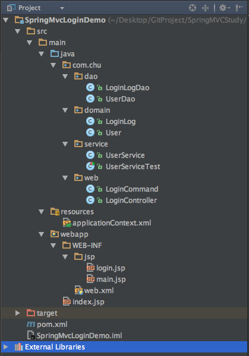

#基于Spring MVC 的HelloWorld

## 1 环境准备

* IntelliJ IDEA 2016.1
* jdk1.8
* maven3.0.5
* tomcat或jetty

## 2 创建库表

```
MariaDB [(none)]> create database sampledb default character set utf8;
Query OK, 1 row affected (0.01 sec)
MariaDB [(none)]> use sampledb;
MariaDB [(none)]> create table t_user(
    -> user_id int auto_increment primary key,
    -> user_name varchar(30),
    -> password varchar(32),
    -> last_visit datetime,
    -> last_ip varchar(23)) engine=innodb;
MariaDB [sampledb]> create table t_login_log(
    -> login_log_id int auto_increment primary key,
    -> user_id int,
    -> ip varchar(23),
    -> login_datetime datetime) engine = innodb;
Query OK, 0 rows affected (0.01 sec)
MariaDB [sampledb]> insert into t_user(user_name,password) values('admin','123456');
Query OK, 1 row affected (0.00 sec)
```
## 创建工程


##完整的项目工程目录



## DAO层相关代码

```
package com.chu.dao;
import java.sql.ResultSet;
import java.sql.SQLException;

import com.chu.domain.LoginLog;
import org.springframework.beans.factory.annotation.Autowired;
import org.springframework.jdbc.core.JdbcTemplate;
import org.springframework.jdbc.core.RowCallbackHandler;
import org.springframework.stereotype.Repository;

/**
 * Created by chuguangming on 16/8/22.
 */
@Repository
public class LoginLogDao {
    @Autowired
    private JdbcTemplate jdbcTemplate;

    public void insertLoginLog(LoginLog loginLog)
    {
        String sqlstr="INSERT INTO t_login_log(user_id,ip,login_datetime) "
                +"Values(?,?,?)";
        Object [] args={loginLog.getUserId(),loginLog.getIp(),loginLog.getLoginDate()};
        jdbcTemplate.update(sqlstr,args);

    }

}


package com.chu.dao;

import java.sql.ResultSet;
import java.sql.SQLException;

import org.springframework.beans.factory.annotation.Autowired;
import org.springframework.jdbc.core.JdbcTemplate;
import org.springframework.jdbc.core.RowCallbackHandler;
import org.springframework.stereotype.Repository;

/**
 * Created by chuguangming on 16/8/19.
 */

import com.chu.domain.User;


@Repository
public class UserDao {

    @Autowired
    private JdbcTemplate jdbcTemplate;

    public int getMatchCount(String userName,String password)
    {
        String sqlStr="select count(*) from t_user "
                +" where user_name=? and password=?";
        return jdbcTemplate.queryForObject(sqlStr,new Object[]{userName,password}, Integer.class);

    }
    public void updateLoginInfo(User user)
    {
        String sqlStr="Update t_user SET last_visit=?,last_ip=? "
                +" where user_id=? ";

        jdbcTemplate.update(sqlStr,new Object[] {user.getLastVisit(),user.getLastIp(),user.getUserID()});

    }

    public User findUserByUserName(final String userName)
    {
        String sqlStr="select user_id,user_name from t_user where user_name=?";
        final User user=new User();
        jdbcTemplate.query(sqlStr, new Object[]{userName},
                new RowCallbackHandler() {
                    public void processRow(ResultSet resultSet) throws SQLException {
                        user.setUserID(resultSet.getInt("user_id"));
                        user.setUserName(userName);
                    }
                });
        return user;
    }

}

```

##DOMAIN相关代码

```
package com.chu.domain;

import java.io.Serializable;
import java.util.Date;

/**
 * Created by chuguangming on 16/8/19.
 */
public class LoginLog implements Serializable {

    private int loginLogId;
    private int userId;
    private Date loginDate;
    private String ip;

    public int getLoginLogId() {
        return loginLogId;
    }

    public void setLoginLogId(int loginLogId) {
        this.loginLogId = loginLogId;
    }


    public int getUserId() {
        return userId;
    }

    public void setUserId(int userId) {
        this.userId = userId;
    }


    public String getIp() {
        return ip;
    }

    public void setIp(String ip) {
        this.ip = ip;
    }

    public Date getLoginDate() {
        return loginDate;
    }

    public void setLoginDate(Date loginDate) {
        this.loginDate = loginDate;
    }


}


package com.chu.domain;
import java.io.Serializable;
import java.util.Date;
/**
 * Created by chuguangming on 16/8/19.
 */
public class User implements  Serializable{

    private int userID;
    private String userName;
    private String passWord;
    private String lastIp;
    private Date lastVisit;


    public int getUserID() {
        return userID;
    }

    public void setUserID(int userID) {
        this.userID = userID;
    }


    public String getUserName() {
        return userName;
    }

    public void setUserName(String userName) {
        this.userName = userName;
    }


    public String getPassWord() {
        return passWord;
    }

    public void setPassWord(String passWord) {
        this.passWord = passWord;
    }


    public String getLastIp() {
        return lastIp;
    }

    public void setLastIp(String lastIp) {
        this.lastIp = lastIp;
    }


    public Date getLastVisit() {
        return lastVisit;
    }

    public void setLastVisit(Date lastVisit) {
        this.lastVisit = lastVisit;
    }


}

```

## Service层相关代码

```
package com.chu.service;

/**
 * Created by chuguangming on 16/8/22.
 */
import org.springframework.beans.factory.annotation.Autowired;
import org.springframework.stereotype.Service;
import com.chu.dao.*;
import com.chu.domain.*;

@Service
public class UserService {
    @Autowired
    private UserDao userDao;

    @Autowired
    private LoginLogDao loginLogDao;

    public boolean hasMatchUser(String userName,String password)
    {
        int matchCount=userDao.getMatchCount(userName,password);
        return matchCount>0;
    }
    public User findUserByUserName(String userName)
    {
        return userDao.findUserByUserName(userName);
    }
    public void loginSuccess(User user)
    {
        LoginLog loginLog=new LoginLog();
        loginLog.setUserId(user.getUserID());
        loginLog.setIp(user.getLastIp());
        loginLog.setLoginDate(user.getLastVisit());
        loginLogDao.insertLoginLog(loginLog);
    }
}

package com.chu.service;

/**
 * Created by chuguangming on 16/8/22.
 */

import org.springframework.test.context.testng.AbstractTransactionalTestNGSpringContextTests;
import org.testng.annotations.*;
import static org.testng.Assert.*;
import org.springframework.beans.factory.annotation.Autowired;
import org.springframework.test.context.ContextConfiguration;
import com.chu.domain.User;

@ContextConfiguration(locations = {"/applicationContext.xml"})
public class UserServiceTest extends AbstractTransactionalTestNGSpringContextTests{

    @Autowired
    private UserService userService;

    @Test
    public void hasMatchUser()
    {
        boolean b1=userService.hasMatchUser("admin","123456");
        boolean b2=userService.hasMatchUser("admin","123456");
        assertTrue(b1);
    }

    @Test
    public void findUserByUserName()
    {
        User user=userService.findUserByUserName("admin");
        assertEquals(user.getUserName(),"admin");
    }
}

```

##WEB层相关代码

```
package com.chu.web;

/**
 * Created by chuguangming on 16/8/22.
 */
public class LoginCommand {
    public String getUserName() {
        return userName;
    }

    public void setUserName(String userName) {
        this.userName = userName;
    }

    private String userName;

    public String getPassWord() {
        return passWord;
    }

    public void setPassWord(String passWord) {
        this.passWord = passWord;
    }

    private String passWord;


}

package com.chu.web;

/**
 * Created by chuguangming on 16/8/22.
 */

import java.util.Date;
import javax.servlet.http.HttpServletRequest;
import org.springframework.beans.factory.annotation.Autowired;
import org.springframework.beans.factory.annotation.Value;
import org.springframework.stereotype.Controller;
import org.springframework.web.bind.annotation.RequestMapping;
import org.springframework.web.servlet.ModelAndView;
import com.chu.domain.*;
import com.chu.service.UserService;


@Controller
@RequestMapping(value = "/admin")
public class LoginController {
    @Autowired
    private UserService userService;

    @RequestMapping(value = "/login.html")
    public String loginPage()
    {
        return "login";
    }

    @RequestMapping(value = "/loginCheck.html")
    public ModelAndView loginCheck(HttpServletRequest request,LoginCommand loginCommand)
    {
        boolean isValidUser=userService.hasMatchUser(loginCommand.getUserName(),loginCommand.getPassWord());
        if (!isValidUser)
        {
            return new ModelAndView("login","error","用户名与密码错误");
        }
        else
        {
            User user=userService.findUserByUserName(loginCommand.getUserName());
            user.setLastIp(request.getRemoteAddr());
            user.setLastVisit(new Date());
            userService.loginSuccess(user);
            request.getSession().setAttribute("user",user);
            return new ModelAndView("main");

        }
    }
}

```

##applicationContext.xml相关配置

```
<?xml version="1.0" encoding="UTF-8"?>
<beans xmlns="http://www.springframework.org/schema/beans"
       xmlns:xsi="http://www.w3.org/2001/XMLSchema-instance"
       xmlns:context="http://www.springframework.org/schema/context"
       xmlns:p="http://www.springframework.org/schema/p"
       xmlns:mvc="http://www.springframework.org/schema/mvc"
       xmlns:aop="http://www.springframework.org/schema/aop"
       xmlns:tx="http://www.springframework.org/schema/tx"

       xsi:schemaLocation="http://www.springframework.org/schema/beans
                        http://www.springframework.org/schema/beans/spring-beans-3.2.xsd
                        http://www.springframework.org/schema/context
                        http://www.springframework.org/schema/context/spring-context-3.2.xsd
                        http://www.springframework.org/schema/mvc
                        http://www.springframework.org/schema/mvc/spring-mvc.xsd
                        http://www.springframework.org/schema/tx
                        http://www.springframework.org/schema/tx/spring-tx-3.2.xsd
                        http://www.springframework.org/schema/aop
                        http://www.springframework.org/schema/aop/spring-aop-3.2.xsd
                        http://www.springframework.org/schema/p ">

    <!--扫描类包,将标注Spring注解的类自动转化Bean,同时完成Bean的注入 -->
    <context:component-scan base-package="com.chu.dao"></context:component-scan>
    <!--扫描service类包,应用Spring的注解配置 -->
    <context:component-scan base-package="com.chu.service"></context:component-scan>


    <!--定义一个使用DBCP实现的数据源 -->
    <bean id="dataSource" class="org.apache.commons.dbcp.BasicDataSource"
          destroy-method="close"
          p:driverClassName="com.mysql.jdbc.Driver"
          p:url="jdbc:mysql://localhost:3306/sampledb"
          p:username="root"
          p:password=""></bean>
    <!--定义JDBC模板Bean -->
    <bean id="jdbcTemplate" class="org.springframework.jdbc.core.JdbcTemplate"
          p:dataSource-ref="dataSource">
    </bean>
    <!--配置事务管理器 -->
    <bean id="transactionManager" class="org.springframework.jdbc.datasource.DataSourceTransactionManager"
          p:dataSource-ref="dataSource"></bean>


    <!--通过AOP配置提供事务增强,让service包下所有的Bean方法拥有事务 -->
    <aop:config proxy-target-class="true">
        <aop:pointcut id="serviceMethod" expression="execution(* com.chu.service..*(..))"></aop:pointcut>
        <aop:advisor pointcut-ref="serviceMethod" advice-ref="txAdvice"></aop:advisor>
    </aop:config>

    <tx:advice id="txAdvice" transaction-manager="transactionManager">
        <tx:attributes>
            <tx:method name="*"/>
        </tx:attributes>
    </tx:advice>

    <!--扫描类包,将标注Spring注解的类自动转化Bean,同时完成Bean的注入 -->
    <context:component-scan base-package="com.chu.web"></context:component-scan>
    <!--配置视图解析器,将ModelAndView及字符串解析为具体的页面 -->
    <bean
            class="org.springframework.web.servlet.view.InternalResourceViewResolver"
            p:viewClass="org.springframework.web.servlet.view.JstlView"
            p:prefix="/WEB-INF/jsp/"
            p:suffix=".jsp"></bean>
</beans>
```

##JSP页面

```
<%--
  Created by IntelliJ IDEA.
  User: chuguangming
  Date: 16/8/22
  Time: 下午3:35
  To change this template use File | Settings | File Templates.
--%>
<%@ page contentType="text/html;charset=UTF-8" language="java" %>
<%@ taglib prefix="c"
           uri="http://java.sun.com/jsp/jstl/core" %>
<html>
<head>
    <title>登录</title>
</head>
<body>
<c:if test="${!empty error}">
    <font color="red"><c:out value="${error}"></c:out></font>
</c:if>
<form action="<c:url value='loginCheck.html'/>" method="post">

    username:<input type="text" name="userName">
    <br/>
    password:<input type="text" name="passWord">
    <br>
    <input type="submit" value="login"/>
    <input type="reset" value="reset"/>
</form>
${user.userName},欢迎进入我们的Spring MVC
</body>
</html>

```

```
<%--
  Created by IntelliJ IDEA.
  User: chuguangming
  Date: 16/8/22
  Time: 下午3:49
  To change this template use File | Settings | File Templates.
--%>
<%@ page contentType="text/html;charset=UTF-8" language="java" %>
<html>
<head>
    <title>Hello Spring MVC</title>
</head>
<body>
${user.userName},欢迎进入我们的Spring MVC
</body>
</html>

```

##web.xml配置文件

```
<?xml version="1.0" encoding="UTF-8"?>
<web-app xmlns="http://java.sun.com/xml/ns/javaee"
         xmlns:xsi="http://www.w3.org/2001/XMLSchema-instance"
         xsi:schemaLocation="http://java.sun.com/xml/ns/javaee
          http://java.sun.com/xml/ns/javaee/web-app_3_0.xsd"
         version="3.0">
  <!--welcome pages-->
  <welcome-file-list>
    <welcome-file>index.jsp</welcome-file>
  </welcome-file-list>

  <!--配置springmvc DispatcherServlet-->
  <servlet>
    <servlet-name>springMVC</servlet-name>
    <servlet-class>org.springframework.web.servlet.DispatcherServlet</servlet-class>
    <init-param>
      <param-name>contextConfigLocation</param-name>
      <param-value>classpath:applicationContext.xml</param-value>
    </init-param>
    <load-on-startup>1</load-on-startup>
    <async-supported>true</async-supported>
  </servlet>

  <servlet-mapping>
    <servlet-name>springMVC</servlet-name>
    <url-pattern>/</url-pattern>
  </servlet-mapping>

</web-app>
```
##完整的pom.xml文件

```
<project xmlns="http://maven.apache.org/POM/4.0.0" xmlns:xsi="http://www.w3.org/2001/XMLSchema-instance"
  xsi:schemaLocation="http://maven.apache.org/POM/4.0.0 http://maven.apache.org/maven-v4_0_0.xsd">
  <modelVersion>4.0.0</modelVersion>
  <groupId>com.chu</groupId>
  <artifactId>SpringMvcLogin</artifactId>
  <packaging>war</packaging>
  <version>1.0-SNAPSHOT</version>
  <name>SpringMvcLogin Maven Webapp</name>
  <url>http://maven.apache.org</url>
  <dependencies>
    <dependency>
      <groupId>junit</groupId>
      <artifactId>junit</artifactId>
      <version>3.8.1</version>
      <scope>test</scope>
    </dependency>
    <!-- https://mvnrepository.com/artifact/org.springframework/spring-core -->
    <dependency>
      <groupId>org.springframework</groupId>
      <artifactId>spring-core</artifactId>
      <version>4.3.2.RELEASE</version>
    </dependency>
    <dependency>
      <groupId>org.springframework</groupId>
      <artifactId>spring-context</artifactId>
      <version>4.3.2.RELEASE</version>
    </dependency>
    <!-- https://mvnrepository.com/artifact/junit/junit -->
    <dependency>
      <groupId>junit</groupId>
      <artifactId>junit</artifactId>
      <version>4.12</version>
    </dependency>
    <dependency>
      <groupId>org.aspectj</groupId>
      <artifactId>aspectjweaver</artifactId>
      <version>1.8.9</version>
    </dependency>
    <!--日志包-->
    <dependency>
      <groupId>junit</groupId>
      <artifactId>junit</artifactId>
      <version>3.8.1</version>
      <scope>test</scope>
    </dependency>
    <dependency>
      <groupId>org.slf4j</groupId>
      <artifactId>slf4j-log4j12</artifactId>
      <version>1.7.21</version>
    </dependency>

    <!--j2ee相关包 servlet、jsp、jstl-->
    <dependency>
      <groupId>javax.servlet</groupId>
      <artifactId>javax.servlet-api</artifactId>
      <version>3.1.0</version>
    </dependency>
    <dependency>
      <groupId>javax.servlet.jsp</groupId>
      <artifactId>jsp-api</artifactId>
      <version>2.2</version>
    </dependency>
    <dependency>
      <groupId>javax.servlet</groupId>
      <artifactId>jstl</artifactId>
      <version>1.2</version>
    </dependency>

    <!--mysql驱动包-->
    <!-- https://mvnrepository.com/artifact/mysql/mysql-connector-java -->
    <dependency>
      <groupId>mysql</groupId>
      <artifactId>mysql-connector-java</artifactId>
      <version>5.1.39</version>
    </dependency>


    <!-- https://mvnrepository.com/artifact/commons-dbcp/commons-dbcp -->
    <dependency>
      <groupId>commons-dbcp</groupId>
      <artifactId>commons-dbcp</artifactId>
      <version>1.4</version>
    </dependency>

    <!--spring相关包-->
    <dependency>
      <groupId>org.springframework</groupId>
      <artifactId>spring-web</artifactId>
      <version>4.3.1.RELEASE</version>
    </dependency>
    <dependency>
      <groupId>org.springframework</groupId>
      <artifactId>spring-webmvc</artifactId>
      <version>4.3.1.RELEASE</version>
    </dependency>
    <!-- https://mvnrepository.com/artifact/org.springframework/spring-test -->
    <dependency>
      <groupId>org.springframework</groupId>
      <artifactId>spring-test</artifactId>
      <version>4.3.2.RELEASE</version>
    </dependency>

    <!-- https://mvnrepository.com/artifact/org.springframework/spring-jdbc -->
    <dependency>
      <groupId>org.springframework</groupId>
      <artifactId>spring-jdbc</artifactId>
      <version>4.3.2.RELEASE</version>
    </dependency>


    <!--其他需要的包-->
    <dependency>
      <groupId>org.apache.commons</groupId>
      <artifactId>commons-lang3</artifactId>
      <version>3.4</version>
    </dependency>
    <dependency>
      <groupId>commons-fileupload</groupId>
      <artifactId>commons-fileupload</artifactId>
      <version>1.3.1</version>
    </dependency>

    <!-- https://mvnrepository.com/artifact/org.testng/testng -->
    <dependency>
      <groupId>org.testng</groupId>
      <artifactId>testng</artifactId>
      <version>6.9.10</version>
    </dependency>

  </dependencies>
  <build>
    <finalName>SpringMvcLogin</finalName>
  </build>
  <repositories>
    <repository>
      <id>jboss</id>
      <url>http://maven.aliyun.com/nexus/content/groups/public/</url>
    </repository>
  </repositories>
</project>

```