#SpringBoot 入门简介

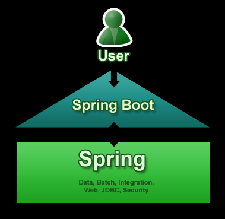

## 一、 springboot是什么？

​现在的web项目几乎都会用到spring框架，而要使用spring难免需要配置大量的xml配置文件，而springboot的出现解决了这一问题，一个项目甚至不用部署到服务器上直接开跑，真像springboot所说：“just run”。springboot的很多默认编码方式都是utf-8.

org.spring 2013年新开发的框架springboot , 它让一个单独项目的创建变得更加的简单，让所有依赖spring的程序可以做到“just run”。springboot提供大量第三方libraries让我们可以非常轻松的开始创建一个spring工程，甚至不需要再去配置一些繁琐的xml配置文件

###springboot框架特点：
1. 创建独立的spring应用。
2. 嵌入Tomcat, Jetty Undertow 而且不需要部署他们。
3. 提供的“starters”poms来简化Maven配置
4. 尽可能自动配置spring应用。
5. 提供生产指标,健壮检查和外部化配置
6. 绝对没有代码生成和XML配置要求

##二、 Springboot快速入门
**还是老样子，为了避免一上手就让大家接触大量的概念，我们先来个Springboot的HelloWorld**

### 1 开发环境设定

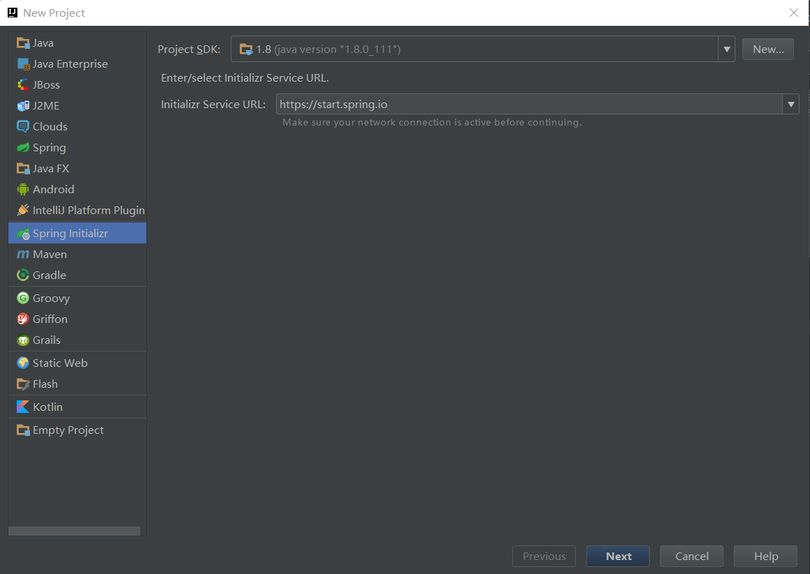

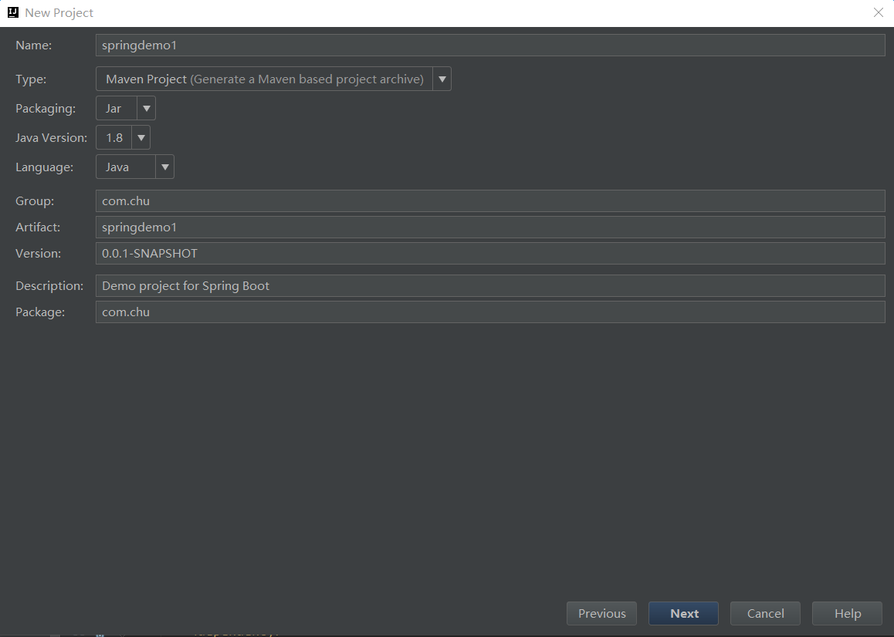

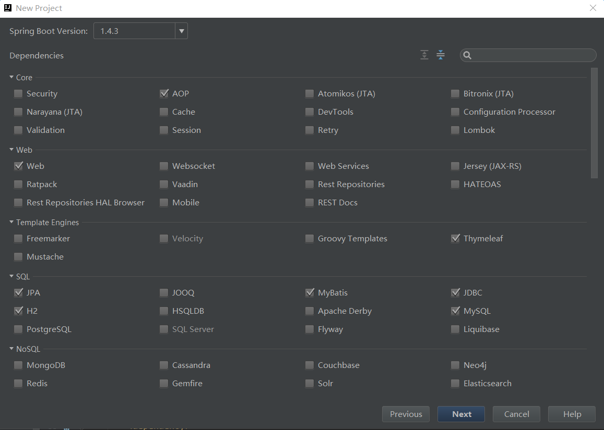

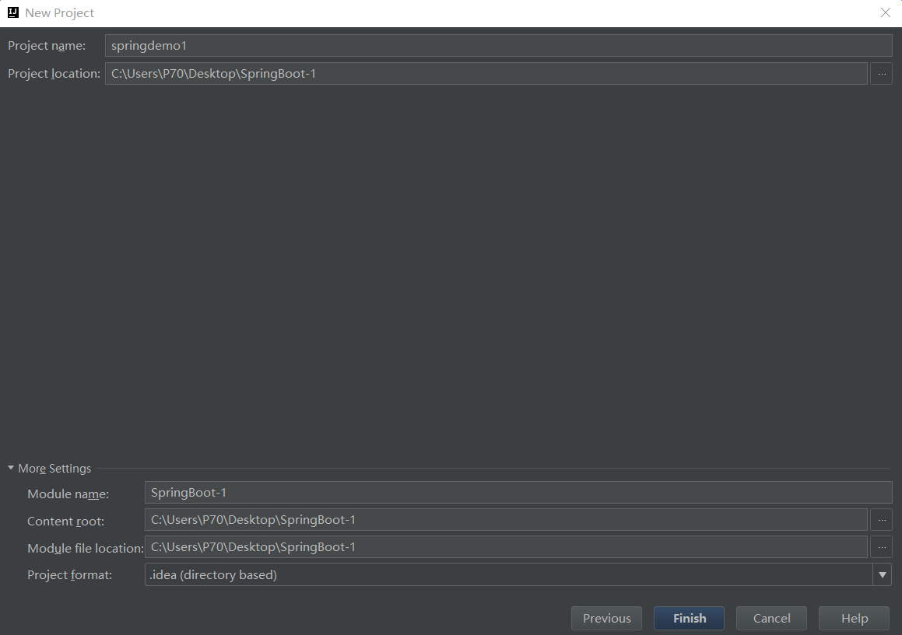

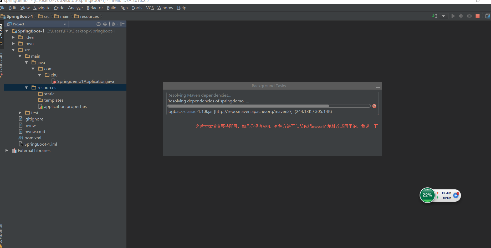

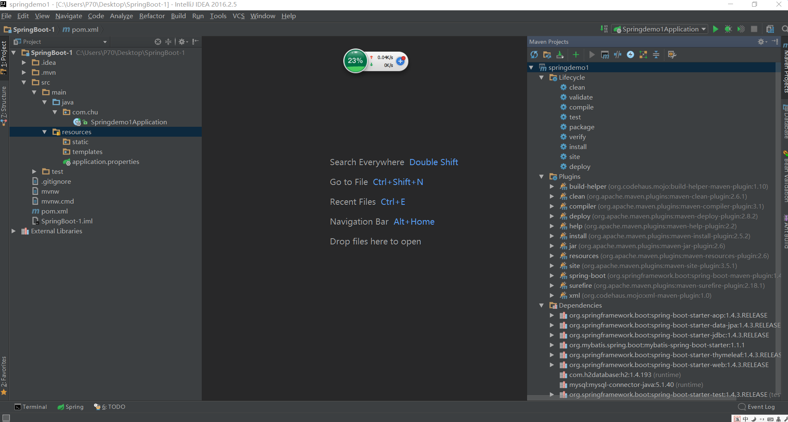


### 2 项目目录结构与基本配置


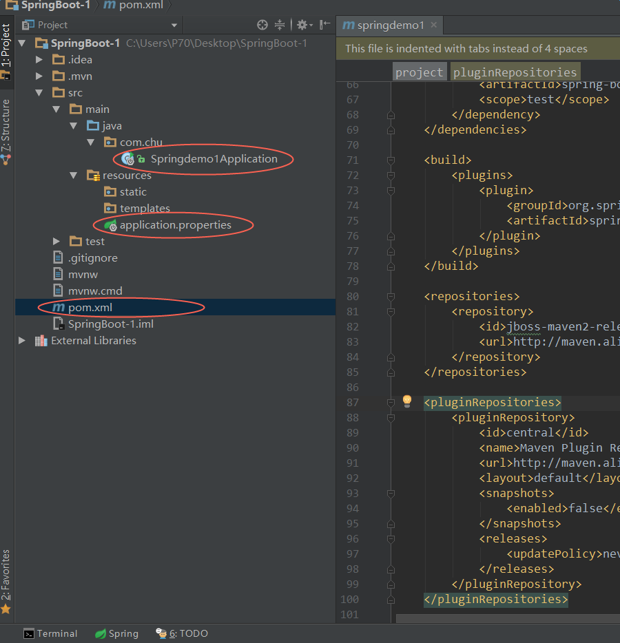

Springdemo1Application:程序的入口文件

'''

```
package com.chu;

import org.springframework.boot.SpringApplication;
import org.springframework.boot.autoconfigure.SpringBootApplication;

@SpringBootApplication
public class Springdemo1Application {

   public static void main(String[] args) {
      SpringApplication.run(Springdemo1Application.class, args);
   }
}
```

'''

application.properties:项目的配置文件,默认是完的


pom.xml:maven配置文件，由于默认的rep非常慢，我建议改成阿里云的镜像


'''

```
<?xml version="1.0" encoding="UTF-8"?>
<project xmlns="http://maven.apache.org/POM/4.0.0" xmlns:xsi="http://www.w3.org/2001/XMLSchema-instance"
   xsi:schemaLocation="http://maven.apache.org/POM/4.0.0 http://maven.apache.org/xsd/maven-4.0.0.xsd">
   <modelVersion>4.0.0</modelVersion>

   <groupId>com.chu</groupId>
   <artifactId>springdemo1</artifactId>
   <version>0.0.1-SNAPSHOT</version>
   <packaging>jar</packaging>

   <name>springdemo1</name>
   <description>Demo project for Spring Boot</description>

   <parent>
      <groupId>org.springframework.boot</groupId>
      <artifactId>spring-boot-starter-parent</artifactId>
      <version>1.4.3.RELEASE</version>
      <relativePath/> <!-- lookup parent from repository -->
   </parent>

   <properties>
      <project.build.sourceEncoding>UTF-8</project.build.sourceEncoding>
      <project.reporting.outputEncoding>UTF-8</project.reporting.outputEncoding>
      <java.version>1.8</java.version>
   </properties>

   <dependencies>
      <dependency>
         <groupId>org.springframework.boot</groupId>
         <artifactId>spring-boot-starter-aop</artifactId>
      </dependency>
      <dependency>
         <groupId>org.springframework.boot</groupId>
         <artifactId>spring-boot-starter-data-jpa</artifactId>
      </dependency>
      <dependency>
         <groupId>org.springframework.boot</groupId>
         <artifactId>spring-boot-starter-jdbc</artifactId>
      </dependency>
      <dependency>
         <groupId>org.mybatis.spring.boot</groupId>
         <artifactId>mybatis-spring-boot-starter</artifactId>
         <version>1.1.1</version>
      </dependency>
      <dependency>
         <groupId>org.springframework.boot</groupId>
         <artifactId>spring-boot-starter-thymeleaf</artifactId>
      </dependency>
      <dependency>
         <groupId>org.springframework.boot</groupId>
         <artifactId>spring-boot-starter-web</artifactId>
      </dependency>

      <dependency>
         <groupId>com.h2database</groupId>
         <artifactId>h2</artifactId>
         <scope>runtime</scope>
      </dependency>
      <dependency>
         <groupId>mysql</groupId>
         <artifactId>mysql-connector-java</artifactId>
         <scope>runtime</scope>
      </dependency>
      <dependency>
         <groupId>org.springframework.boot</groupId>
         <artifactId>spring-boot-starter-test</artifactId>
         <scope>test</scope>
      </dependency>
   </dependencies>

   <build>
      <plugins>
         <plugin>
            <groupId>org.springframework.boot</groupId>
            <artifactId>spring-boot-maven-plugin</artifactId>
         </plugin>
      </plugins>
   </build>

   <repositories>
      <repository>
         <id>jboss-maven2-release-repository</id>
         <url>http://maven.aliyun.com/nexus/content/groups/public/</url>
      </repository>
   </repositories>

   <pluginRepositories>
      <pluginRepository>
         <id>central</id>
         <name>Maven Plugin Repository</name>
         <url>http://maven.aliyun.com/nexus/content/groups/public/</url>
         <layout>default</layout>
         <snapshots>
            <enabled>false</enabled>
         </snapshots>
         <releases>
            <updatePolicy>never</updatePolicy>
         </releases>
      </pluginRepository>
   </pluginRepositories>

</project>
```

'''

将项目中的jdk版本改成1.8,有的时候IDEA默认是1.5

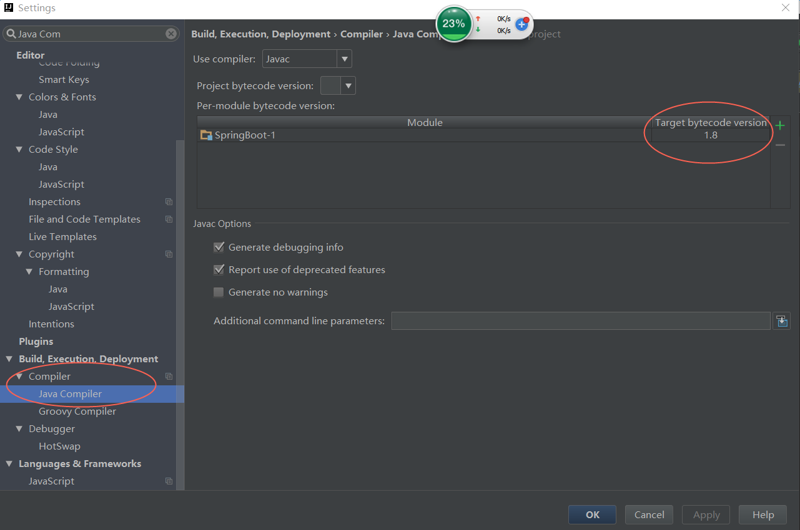

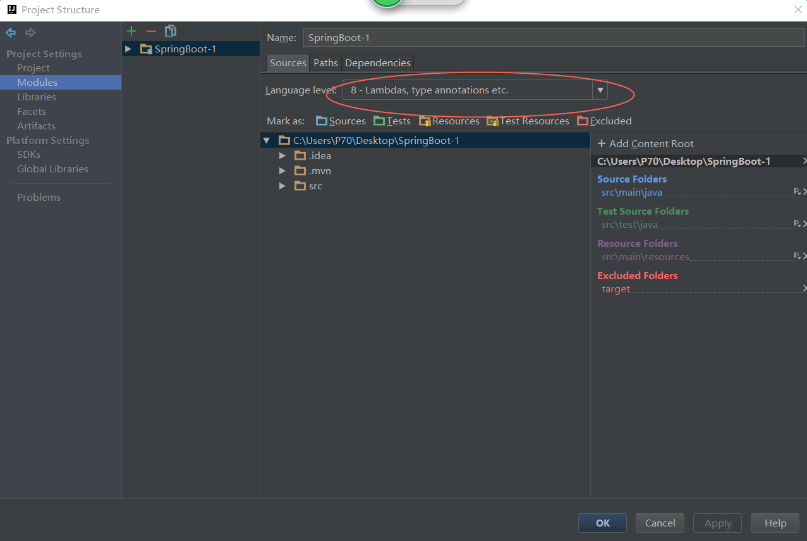


### 3 开始第一个Controller

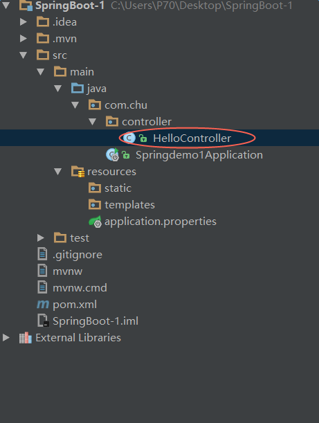

* 创建`package`命名为`com.chu.controller`（根据实际情况修改）
* 创建`HelloController`类，内容如下

'''

```
package com.chu.controller;

import org.springframework.web.bind.annotation.RequestMapping;
import org.springframework.web.bind.annotation.RestController;

/**
 * Created by P70 on 2016/12/23.
 */
@RestController
public class HelloController {
    @RequestMapping("/hello")
    public String index() {
        return "Hello World";
    }
}
```

'''

* 启动主程序，打开浏览器访问`http://localhost:8080/hello`，可以看到页面输出`Hello World`


### 4 编写单元测试用例

* 打开的`src/test/`下的测试入口`Springdemo1ApplicationTests`类。下面编写一个简单的单元测试来模拟http请求，具体如下：

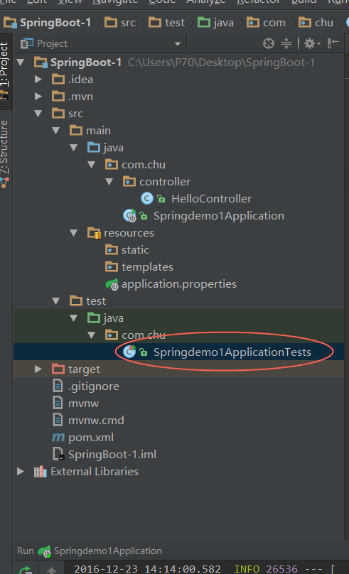


'''

```
package com.chu;

import com.chu.controller.HelloController;
import org.junit.Before;
import org.junit.Test;
import org.junit.runner.RunWith;
import org.springframework.boot.test.SpringApplicationConfiguration;
import org.springframework.boot.test.context.SpringBootTest;
import org.springframework.http.MediaType;
import org.springframework.mock.web.MockServletContext;
import org.springframework.test.context.junit4.SpringJUnit4ClassRunner;
import org.springframework.test.context.junit4.SpringRunner;
import org.springframework.test.context.web.WebAppConfiguration;
import org.springframework.test.web.servlet.MockMvc;
import org.springframework.test.web.servlet.request.MockMvcRequestBuilders;
import org.springframework.test.web.servlet.setup.MockMvcBuilders;

import static org.springframework.test.web.client.match.MockRestRequestMatchers.content;
import static org.springframework.test.web.servlet.result.MockMvcResultMatchers.status;

@RunWith(SpringJUnit4ClassRunner.class)
@SpringApplicationConfiguration(classes = MockServletContext.class)
@WebAppConfiguration
public class Springdemo1ApplicationTests {

   private MockMvc mvc;
   @Before
   public void setUp() throws Exception {
      mvc = MockMvcBuilders.standaloneSetup(new HelloController()).build();
   }
   @Test
   public void getHello() throws Exception {
      mvc.perform(MockMvcRequestBuilders.get("/hello").accept(MediaType.APPLICATION_JSON))
            .andExpect(status().isOk());
   }

}
```

'''

代码[下载地址：](https://github.com/chu888chu888/SpringMVCStudy/raw/master/source/springboot/SpringBoot-1.zip)