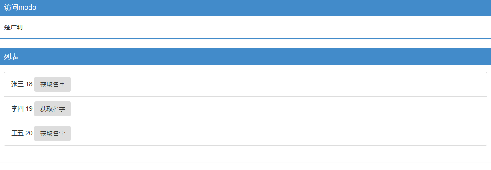
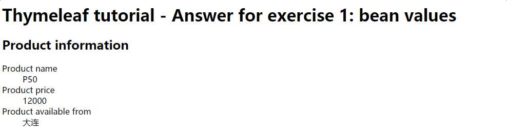

#SpringBoot 开发基本的WEB应用

## 一、 静态资源的访问

​SpringBoot默认提供静态资源目录位置在classpath下，目录名需要符合如下规则：
1. /static
2. /public
3. /resources
4. /META-INF/resources

举例：我们可以在`src/main/resources/`目录下创建`static`,在该位置放置一个图片文件，启动程序后，尝试访问`http://localhost:8080/D.jpg`。如果可以显示图片，配置成功。


## 二 渲染WEB页面

 在之前的实例中，我们是通过@RestController来处理请求，所以返回的内容为json对象。那么如果需要渲染html页面的时候，要如何实现呢？

 ###1 模板引擎

 在动态HTML实现上Springboot依然可以完美胜任，并且提供了多种模板引擎的默认配置支持，所以在推荐的模板引擎下，我们可以很快的上手开发动态网站。

 SpringBoot提供了默认配置的模板引擎主要有以下几种：
 1. Thymeleaf
 2. FreeMarker
 3. Velocity
 4. Groovy
 5. Mustache

 **SpringBoot 建议使用这些模板引擎，避免使用JSP，若一定要使用JSP将无法实现SpringBoot的多种特性。**

当你使用上述模板引擎中的任何一个，它们默认的模板配置路径为： `src/main/resources/templates` .当然也可以修改这个路径。

### 2 Thymeleaf

Thymeleaf是一个XML/XHTML/HTML5的模板引擎，可用于WEB与非WEB环境中的应用开发，这是一个开源的JAVA库，基于Apache License 2.0许可。

Thymeleaf提供了一个用于整合SpringMVC的可选模块，在应用开发中，你可以使用Thymeleaf来完全替代JSP或者其他模板引擎。如Velocity/FreeMarker等。Thymeleaf的主要目标在于提供一种可被浏览器正确显示的、格式良好的模板创建方式，因此也可以用作静态建模。你可以使用它创建经过验证的XML与HTML模板。相对于编写逻辑或代码，开发者只需将标签属性添加到模板即可。接下来，这些标签属性就会在DOM（文档对象模型）上执行预先制定好的逻辑。

1. Thymeleaf 在有网络和无网络的环境下皆可运行，即它可以让美工在浏览器查看页面的静态效果，也可以让程序员在服务器查看带数据的动态页面效果。这是由于它支持 html 原型，然后在 html 标签里增加额外的属性来达到模板+数据的展示方式。浏览器解释 html 时会忽略未定义的标签属性，所以 thymeleaf 的模板可以静态地运行；当有数据返回到页面时，Thymeleaf 标签会动态地替换掉静态内容，使页面动态显示。
2. Thymeleaf 开箱即用的特性。它提供标准和spring标准两种方言，可以直接套用模板实现JSTL、 OGNL表达式效果，避免每天套模板、该jstl、改标签的困扰。同时开发人员也可以扩展和创建自定义的方言。
3. Thymeleaf 提供spring标准方言和一个与 SpringMVC 完美集成的可选模块，可以快速的实现表单绑定、属性编辑器、国际化等功能。


### 3 一个快速的例子

* 加入thymeleaf支持，修改pom.xml:

```
<dependency>
		<groupId>org.springframework.boot</groupId>
		<artifactId>spring-boot-starter-thymeleaf</artifactId>
</dependency>
```

* 编写一个controller

```
package com.chu.controller;

import org.springframework.ui.ModelMap;
import org.springframework.web.bind.annotation.RequestMapping;
import org.springframework.web.bind.annotation.RestController;

/**
 * Created by P70 on 2016/12/23.
 * 如果你写成RestController的话，就不会返回模板，而是直接给你返回一个文本
 */
@Controller
public class HelloController {

    @RequestMapping("/hello")
    public String index() {
        return "Hello World";
    }

    @RequestMapping("/thymeleafviewdemo")
    public String index(ModelMap map) {
        // 加入一个属性，用来在模板中读取
        map.addAttribute("host", "http://www.sina.com.cn");
        // return模板文件的名称，对应src/main/resources/templates/thymeleafviewdemo.html
        return "thymeleafviewdemo";
    }
}
```

* 修改thymeleafviewdemo.html

```
<!DOCTYPE html>
<html xmlns="http://www.w3.org/1999/xhtml"
      xmlns:th="http://www.thymeleaf.org">
<head lang="en">
    <meta charset="UTF-8" />
    <title></title>
</head>
<body>
<h1 th:text="${host}">Hello World</h1>
</body>
</html>
```

如上页面，直接打开html页面展示Hello World，但是启动程序后，访问```h ttp://localhost:8080``` ,则是展示Controller中host的值：```http://www.sina.com.cn```,做到不破坏Html自身内容的数据逻辑分离。

### 4 Thymeleaf的默认参数配置

如有需要修改默认配置的时候，只需要复制下面要修改的属性到```application.properties```中，并修改成需要的值，如修改模板文件的扩展名，修改默认的模板路径等。

```
# Enable template caching.
spring.thymeleaf.cache=true 
# Check that the templates location exists.
spring.thymeleaf.check-template-location=true 
# Content-Type value.
spring.thymeleaf.content-type=text/html 
# Enable MVC Thymeleaf view resolution.
spring.thymeleaf.enabled=true 
# Template encoding.
spring.thymeleaf.encoding=UTF-8 
# Comma-separated list of view names that should be excluded from resolution.
spring.thymeleaf.excluded-view-names= 
# Template mode to be applied to templates. See also StandardTemplateModeHandlers.
spring.thymeleaf.mode=HTML5 
# Prefix that gets prepended to view names when building a URL.
spring.thymeleaf.prefix=classpath:/templates/

#THYMELEAF    (ThymeleafAutoConfiguration) 
#spring.thymeleaf.check-template-location=true 
#spring.thymeleaf.prefix=classpath:/templates/ 
#spring.thymeleaf.excluded-view-names=    
spring.thymeleaf.mode=HTML5
spring.thymeleaf.encoding=UTF-8
spring.thymeleaf.content-type=text/html    
spring.thymeleaf.cache=true
```

## 三 复杂一些的Thymeleaf模板

### 1 基于类的数据载体

* 新建Person类，作为数据载体

```
package com.chu.model;

/**
 * Created by P70 on 2016/12/26.
 */
public class Person {

    private String name;

    private int age;

    public Person(String name,int age) {
        this.name = name;
        this.age = age;
    }

    public String getName() {
        return name;
    }
    public void setName(String name) {
        this.name = name;
    }
    public int getAge() {
        return age;
    }
    public void setAge(int age) {
        this.age = age;
    }
}
```

* 新建一个Controller

```
package com.chu.controller;

import com.chu.model.Person;
import org.springframework.stereotype.Controller;
import org.springframework.ui.Model;
import org.springframework.web.bind.annotation.RequestMapping;

import java.util.ArrayList;
import java.util.List;

/**
 * Created by P70 on 2016/12/26.
 */
@Controller
public class PersonController {
    @RequestMapping("/PersonView")
    public String index(Model model){
        Person onePerson = new Person("微儿博客", 18);

        List<Person> list = new ArrayList<Person>();
        Person p1 = new Person("张三", 18);
        Person p2 = new Person("李四", 19);
        Person p3 = new Person("王五", 20);
        list.add(p1);
        list.add(p2);
        list.add(p3);

        model.addAttribute("oneperson", onePerson);//向模板传数据
        model.addAttribute("people", list);
        return "person";//找到名为person.*的模板
    }
}

```

* 新建一个对应的模板

```
<!DOCTYPE html>
<html xmlns:th="http://www.w3.org/1999/xhtml">
<head>
    <meta charset="UTF-8"/>
    <title>test</title>
    <link th:href="@{css/bootstrap.min.css}" rel="stylesheet"/>
</head>
<body>
<div class="panel panel-primary">
    <div class="panel-heading">
        <h3 class="panel-title">访问model</h3>
    </div>
    <div class="panel-body">
        <span th:text="${oneperson.name}"></span>
    </div>
</div>
<div th:if="${not #lists.isEmpty(people)}">
    <div class="panel panel-primary">
        <div class="panel-heading">
            <h3 class="panel-title">列表</h3>
        </div>
        <div class="panel-body">
            <ul class="list-group">
                <li class="list-group-item" th:each="person:${people}">
                    <span th:text="${person.name}"></span>
                    <span th:text="${person.age}"></span>
                    <button class="btn" th:onclick="'getName(\''+${person.name}+'\');'">获取名字</button>
                </li>
            </ul>
        </div>
    </div>
</div>
<script type="text/javascript" th:src="@{js/jquery-1.12.3.min.js}"></script>
<script type="text/javascript" th:src="@{js/bootstrap.min.js}"></script>
<script th:inline="javascript">
    function getName(name){
        alert(name);
    }
</script>
</body>
</html>
```

* 结果



代码[下载地址：](https://github.com/chu888chu888/SpringMVCStudy/raw/master/source/springboot/SpringBoot-2.zip)


## 2 Bean值的替换

* Controller

```java
package com.chu.controller;

import com.chu.model.Product;
import org.springframework.stereotype.Controller;
import org.springframework.ui.ModelMap;
import org.springframework.web.bind.annotation.RequestMapping;
import org.springframework.web.bind.annotation.RestController;

/**
 * Created by P70 on 2016/12/23.
 */
@Controller
public class HelloController {
    @RequestMapping("/thymeleafviewdemo2")
    public String index2(ModelMap map) {
        Product product=new Product("P50","12000","大连");

        // 加入一个属性，用来在模板中读取
        map.addAttribute("product", product);
        // return模板文件的名称，对应src/main/resources/templates/thymeleafviewdemo2.html
        return "thymeleafviewdemo2";
    }

}

```


* Model

```java
package com.chu.model;

/**
 * Created by P70 on 2016/12/27.
 */
public class Product {
    private String description;
    private String price;
    private String availableFrom;

    public String getDescription() {
        return description;
    }

    public void setDescription(String description) {
        this.description = description;
    }

    public String getPrice() {
        return price;
    }

    public void setPrice(String price) {
        this.price = price;
    }

    public String getAvailableFrom() {
        return availableFrom;
    }

    public void setAvailableFrom(String availableFrom) {
        this.availableFrom = availableFrom;
    }
}

```


* View

```html
<!DOCTYPE html>
<html xmlns:th="http://www.w3.org/1999/xhtml">
<head lang="en">
    <meta charset="UTF-8" />
    <title></title>
</head>
<body>
<h1>Thymeleaf tutorial - Answer for exercise 1: bean values</h1>
<h2>Product information</h2>
<dl>
    <dt>Product name</dt>
    <dd th:text="${product.description}">Red Chair</dd>

    <dt>Product price</dt>
    <dd th:text="${product.price}">350</dd>

    <dt>Product available from</dt>
    <dd th:text="${product.availableFrom}">2014-12-01</dd>
</dl>
</body>
</html>
```



## 3 资源文件乱码问题

#### 问题描述

当在`.properties`的配置文件中有中文时，读取出来的总是乱码。比如我的`application.properties`配置文件的内容如下：

```yaml
server.port=9090
test.msg=你好：Springboot
```

当在程序中读取`test.msg`值时总是会得到乱码，默认是以`ISO-8859-1`的字符编码读取，尝试的方法有：


1. 添加配置

```yaml
banner.charset=UTF-8
server.tomcat.uri-encoding=UTF-8
spring.http.encoding.charset=UTF-8
spring.http.encoding.enabled=true
spring.http.encoding.force=true
spring.messages.encoding=UTF-8
```


2. 设置文件类型

将`application.properites`的文件类型修改为`UTF-8`的编码类型。

通过以上方法测试获取出来的值还是乱码。

### · 解决办法

设置 `File Encodings`的`Transparent native-to-ascii conversion`为`true`，具体步骤如下：依次点击

File -> Settings -> Editor -> File Encodings

将`Properties Files (*.properties)`下的`Default encoding for properties files`设置为`UTF-8`，将`Transparent native-to-ascii conversion`前的勾选上。


## 4 Thymeleaf模板使用


